# MakeCode 教程

## MakeCode 开发环境配置

### 1.安装 IDE

Micro:bit是一款无需安装IDE产品，只需要在网页上进行编程下载即可。网址：[https://makecode.microbit.org/](https://makecode.microbit.org/)

当然如果需要离线版本，Makecode离线软件下载链接：[https://makecode.microbit.org/offline-app](https://makecode.microbit.org/offline-app) 

Makecode离线软件更新教程：

首先，我们打开软件，在右上角点击“**设置**”图案，然后再点击“**关于**”。

然后进入“**关于**”界面，点击“确定”确定是最新版本。

### 2.安装Micro：bit 驱动

Micro:bit是可以免安装USB驱动的。如果你的电脑已经安装过micro:bit 驱动，就不需要再次安装micro:bit驱动。假如你是首次使用micro:bit主板，则你的电脑需要安装micro:bit驱动。如果你的电脑识别不了Micro:bit主板，则需要安装一下Micro:bit驱动，我们提供有Micro:bit 驱动文件，你可以进入相关文件夹中根据安装说明书进行安装。

下面给Micro:bit主板安装驱动。

首先将Micro:bit主板用Micro USB数据线连接到电脑上，然后鼠标左键双击驱动文件，出现如下页面再点击“**下一页**”。

先点击“**安装**”，几秒种后，安装完成，再点击“**完成**”。这样，驱动安装完成。

安装完成后，点击“**我的电脑**” —>“**属性**”—> “**设备管理器**”, 我们可以看到下图。

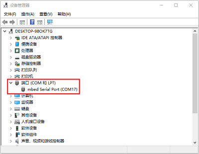

### 3.快速开始 
                                         
以下的步骤说明基于Windows操作系统，如果你使用的是其他操作系统，可以将其作为参考。

#### （1）代码与编程  

本节介绍如何为Micro:bit编写程序以及如何将其下载到Micro:bit主板。 Micro:bit官方网站上有非常详细的教程， 您可以参考：[https://microbit.org/guide/quick/](https://microbit.org/guide/quick/)

**步骤 1: 连接Micro:bit主板**

通过Micro USB线将Micro:bit主板连接到电脑。

Micro:bit主板背后的红色LED点亮，表明Micro:bit主板有电了。

Micro:bit 将在您的电脑上显示为一个名为'MICROBIT'的驱动器。但请注意，它不是普通的USB磁盘！如下图：

**步骤 2: 编写程序** 

在浏览器中访问链接：[https://makecode.microbit.org/](https://makecode.microbit.org/) ，然后单击“**新建项目**”，出现“**创建项目**”对话框，在对话框中输入“**心跳**”，单击“**创建**”并开始编程。

（以下是以Google Chrome为例，其他浏览器类似）

①使用MakeCode编辑器，写一个Micro:bit代码。 例如，从模块区拖放一些指令方块放入代码编辑区。

下一节将进一步介绍MakeCode。

②点击“JS JavaScript”，你可以看到对应的JavaScript语言代码程序，如下图：

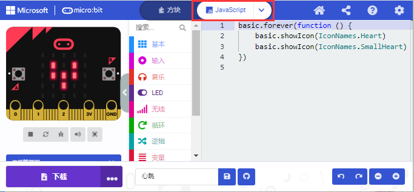

③你还可以点击“JS JavaScript ”，再点击下拉按钮选择“Python”，你还可以看到对应的Python语言代码程序，如下图：

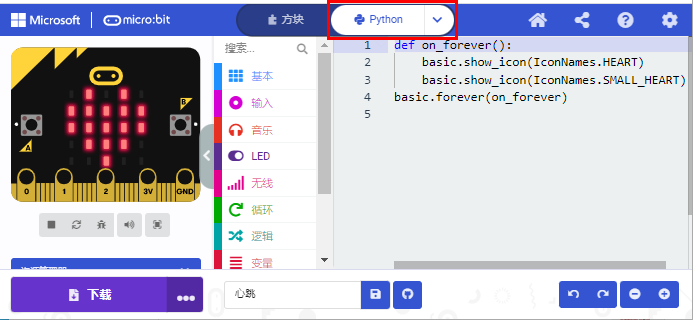

**步骤 3: 下载代码** 

单击编辑器中的“**下载**”按钮。 这将下载一个“hex”文件，该文件是Micro:bit主板可以读取的紧凑程序格式。 十六进制文件下载后，将其复制到你的Micro:bit主板，就像将文件复制到USB驱动器一样。 在Windows上，你还可以右键单击并选择“发送到→MICROBIT（E）”将“hex”文件拷贝到Micro:bit主板。

也可以将“.hex”文件直接拖入MICROBIT（E）磁盘中。

将下载好的“hex”文件拷贝到Micro:bit主板过程中，Micro:bit主板背面的黄色信号灯会闪烁，当拷贝完成后黄色信号灯停止闪烁，保持长亮。

**步骤: 运行程序**

代码程序上传Micro: bit 主板后，通过Micro USB线或外接电源给Micro: bit主板供电，Micro: bit 主板上的5 x 5 LED点阵显示心跳的图案。

micro USB线供电

外接电源供电（3.3V）

每次编程时，MICROBIT驱动器都会自动弹出并返回，但是你的hex文件将会消失。 
Micro: bit主板只能接收.hex文件，不会存储任何其他文件！

**步骤5：掌握**

本小节向你展示了如何开始使用Micro:bit，但是除了MakeCode之外，您还可以使用Python语言和基于文本的JavaScript语言来编写Micro:bit。转到：[https://microbit.org/code/](https://microbit.org/code/) 查看不同的语言，或查看：[https://microbit.org/projects/](https://microbit.org/projects/) ，了解你可能想要尝试的一些内容。

#### （2）Makecode 

在Google Chrome访问链接：[https://makecode.microbit.org/](https://makecode.microbit.org/) ， 打开MakeCode在线版本。

点击 “**新建项目**”,出现“**创建项目**”对话框，在对话框中输入“**心跳**”，单击“**创建**”进入MakeCode 编译器，MakeCode 编译器如下: 

在代码编辑区中，有两个固定的指令方块“**当开机时**”和“**无限循环**”。 

上电或复位后，“**当开机时**”指令方块中的代码将仅执行一次；并且“**无限循环**”指令方块中的代码将循环执行。

#### （3）快速下载

使用MakeCode的浏览器版本下载编写好的代码程序可能需要更多步骤。 但是，如果您将Google Chrome 用于Android，ChromeOS，Linux，macOS和Windows 10系统，则可以实现快速下载功能。

在这里，我们使用Chrome的webUSB功能，该功能允许网页访问您的Micro USB硬件设备。
 我们将按照以下步骤完成Micro：bit设备与网页的连接和配对。 

**配对装置：**

用Micro USB线连接电脑和Micro: bit主板。

单击“**下载**”后面的“**...**”，然后单击“**连接设备**”。 

然后继续单击“**下一步**”按钮。

再继续单击“**下一步**”按钮。

在弹出窗口中选中对应的“**设备**”，然后单击“**连接**”按钮。 如果弹出窗口中没有设备，请参考以下内容：[https://makecode.microbit.org/device/usb/webusb/troubleshoot](https://makecode.microbit.org/device/usb/webusb/troubleshoot)。

当然，如果你不想点击链接进入相关页面中查看，你也可以在“相关其他资料”教程中直接阅读“**用WebUSB排除下载过程中的故障**”。 

如果你的Micro:bit主板出现问题是需要更新Micro:bit的固件，在“相关其他资料”教程中的“**如何更新micro:bit主板的固件**”介绍了如何更新Micro:bit的固件，其内容来自：[https://microbit.org/guide/firmware/](https://microbit.org/guide/firmware/) 

单击“**完成**”，设备连接成功。

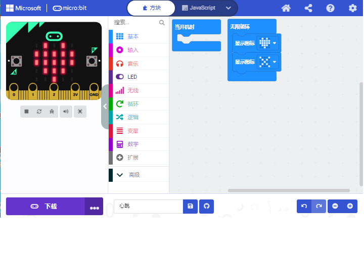

**程序下载：**

设备连接成功后，单击“**下载**”按钮，程序将直接下载到Micro:bit主板。

注意：有的系统不支持快速下载方式，比如在电脑的设备管理器中可以看到在线驱动CMSIS-DAP安装不成功就不支持快速下载；需要选择其它程序上传方式。比如：**右键单击并选择“发送到→MICROBIT（E）”将“hex”文件拷贝到Micro:bit主板。** 等程序上传方式。

### 4.MakeCode扩展库：

为了轻松使用Microbit4自由度机械手臂 ，我们为Micro:bit 4自由度机械手臂制作了一个MakeCode扩展库。

**（1）添加4自由度机械手臂Micro:bit 扩展库：** 

您可以通过以下方法添加4自由度机械手臂Micro:bit扩展库文件。

打开MakeCode，先点击右上角的齿轮图标（设置），再点击“扩展”。

或者单击“**高级**”上的“**扩展**”。

在搜索框中输入链接：`https://github.com/keyestudio2019/pxt-pca9685-smallest`，然后单击搜索。

单击搜索结果pca9685以下载并安装。 该过程可能需要几秒钟。

安装完成后，你可以在左侧找到pca9685的扩展库。

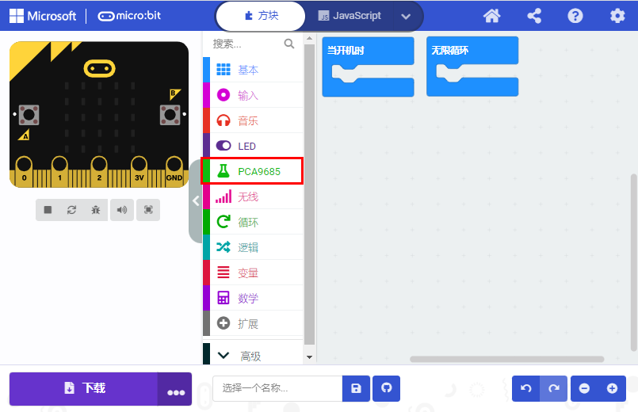

注意：添加到项目中的扩展库仅对该项目有效，而不会出现在其他项目中。 因此，当你创建新项目代码时，需要再次添加pca9685扩展库。

**（2）更新或删除pca9685扩展库：**

如果您需要更新或删除pca9685扩展库文件，请按照以下说明进行操作。 

点击 "Js JavaScript" 按钮切换到文本代码。

点击左边的“**资源管理器**”.

在扩展列表中找到扩展库文件。单击垃圾箱图标以删除pca9685扩展库文件。单击刷新图标以更新pca9685扩展库文件。

### 5.导入代码方法：

我们为每个项目提供十六进制代码文件（项目文件）。十六进制代码文件包含项目的所有内容，可以直接导入，你也可以手动拖动代码块来完成每个项目的代码程序。如果选择通过手动拖动代码块来完成项目代码，则可能需要添加必要的扩展库。

对于简单项目，建议通过拖动代码块来完成项目。

对于复杂的项目，建议通过导入我们提供的十六进制代码文件来完成项目. 

接下来，我们以“ 心跳”项目为例，介绍如何加载代码。

打开Web版本Makecode或离线版本Makecode，单击“**导入**”。

在弹出的对话框中，单击“**导入文件**”。

选择文件“ ..\教程代码+Python库文件\教程代码\MakeCode 代码\Microbit 基础课程\microbit-第01课：心跳.hex”。 然后点击“继续！√”

除了上述将提供的项目代码程序文件直接导入到Makecode编译器中的方法之外，也可以将我们提供的项目代码程序文件直接拖入到Makecode编译器中的代码编辑区，如下图所示：

几秒钟后，项目成功加载。

注意：如果你的电脑系统是Windows7/8而不是Windows 10，则在Google Chrome中是无法进行设备配对，从而读取不了一些传感器/模块的数字信号或模拟信号，可是又需要读取相应的传感器/模块的数字信号或模拟信号，那怎么办呢？这里就可以使用CoolTerm软件来读取串口数据的，下面是CoolTerm安装方法。

### 6.CoolTerm软件安装方法： 

这里需要安装CoolTerm程序软件，CoolTerm程序软件是用来在下面的一些实验中读取串口通讯的，这里我们提供了CoolTerm程序软件的下载链接：[https://freeware.the-meiers.org/](https://freeware.the-meiers.org/)

（**提醒：如果下载网络不好，可以使用我们提供的，在对应的文件夹中提供有CoolTerm软件**）

（1）现在，让我们来安装CoolTerm程序软件，这里我们是以PC Windows系统为例，选择下载安装CoolTerm Win，下载后解压并打开。（Mac系统和 Linux系统也类似）

（2）左键双击程序文件。（注意：必须保证micro:bit驱动已安装和micro:bit主板连接到电脑上）

工具栏上每个按钮的功能如下所示：

||打开一个新的终端机|
| :--: | :--: |
||打开保存好的连接|
||保存|
||打开串行连接|
||关闭串行连接|
||清除接收到的数据|
||打开“连接选项”对话框|
||以十六进制格式显示终端数据|
||帮助|

## Microbit 基础课程

### 第01课 心跳

 Micro:bit 基础课程是使用Micro:bit主板自带的传感器模块和LED点阵。

**1.实验说明：**

首先先来练习一个不需要其他辅助元件，只需要一块Micro:bit主板，一根Micro USB数据线与一台计算机的简单实验，让Micro:bit主板上的点阵显示“心跳”，这是一个让Micro:bit主板和计算机通信的实验，这也是一个入门实验，希望可以带领大家进入Micro:bit的魔幻世界。

**2.准备：**                                                                                    

（1）通过Micro USB线连接Micro:bit主板和电脑。

（2）打开离线版本或Web版本的MakeCode。 

如果是选择通过导入Hex文件来加载项目，请单击“导入”。

如果要一一拖动代码块，请单击“**新建项目**”。

**3.实验代码：**
                                                                                
可以直接加载我们提供的程序，也可以自己通过拖动代码块来编写代码程序，操作步骤如下：

**（1）寻找代码块**

**（2）完整的代码程序**

**4.实验结果:**                                                                                

按照之前的方式将代码下载到Micro:bit主板，Micro USB数据线不要拔下来，利用Micro USB数据线上电，Micro:bit主板上的LED点阵屏切换显示“❤”图案和“”图案，循环进行。

如果存在下载问题，请断开Micro USB线和Micro:bit主板，然后重新连接它们并重新打开MakeCode编辑器，以尝试再次下载。

### 第02课 LED点阵中单个LED显示

**1.实验说明：**                                                                                
 

 Micro:bit主板的LED点阵共由25个发光二极管组成，5个一组，分别对应X和Y方向，形成一个5×5的矩阵，且每个发光二极管是放置在行线（X）和列线（Y）的交叉点上，我们可以通过设置坐标点来实现对25个LED中某一个LED的控制。例如，想要LED点阵中第1行第1个LED点亮，可以设置坐标点为（0，0）；第1行第3个LED点亮，可以设置坐标点为（2，0）；第1列第5个LED点亮，可以设置坐标点为（0，4）；第3列第2个LED点亮，可以设置坐标点为（2，1），依此类推。

**2.准备：**                                                                                    

（1）通过Micro USB线连接Micro:bit主板和电脑。

（2）打开离线版本或Web版本的MakeCode。 

如果是选择通过导入Hex文件来加载项目，请单击“导入”。

如果要一一拖动代码块，请单击“**新建项目**”。

**3.实验代码：** 

可以直接加载我们提供的程序，也可以自己通过拖动代码块来编写代码程序，操作步骤如下：

**（1）寻找代码块**

**（2）完整的代码程序：**

**4.实验结果：** 

按照之前的方式将代码下载到Micro:bit主板，Micro USB数据线不要拔下来，利用Micro USB数据线上电，我们就可以看到切换坐标点(1,0)的LED的亮灭状态，持续0.5s，再次切换坐标点(1,0)的LED的亮灭状态，持续0.5s；点亮坐标点(3,4)的LED，持续0.5s，熄灭坐标点(3,4)的LED，持续0.5s。循环进行。

### 第03课 5 x 5 LED点阵图案显示

**1.实验说明：** 

点阵在我们生活中很常见，很多都有用到它，比如LED广告显示屏，电梯显示楼层，公交车报站等等。

Micro:bit主板的LED点阵共由25个发光二极管组成，上一课我们已经讲过通过设置坐标点来实现对LED点阵的25个LED中的某个LED的控制，这样可以通过设置多个坐标点控制多个LED的亮灭使得LED点阵能够显示图案、数字、字符串。我们也可以在特定代码中通过点击 LED点阵的灰白色小正方形点亮 LED点阵对应的LED来实现LED点阵显示图案、数字、字符串。除了上述方法还可以使用自定义图案使LED点阵显示图案。

**2.准备：** 

（1）通过Micro USB线连接Micro:bit主板和电脑。

（2）打开离线版本或Web版本的MakeCode。 

如果是选择通过导入Hex文件来加载项目，请单击“导入”。

如果要一一拖动代码块，请单击“**新建项目**”。

**3.实验程序1：**

可以直接加载我们提供的程序，也可以自己通过拖动代码块来编写代码程序，操作步骤如下：

**（1）寻找代码块**

**（2）完整的代码程序：**

**4.实验结果1：**

按照之前的方式将代码1下载到Micro:bit主板，Micro USB数据线不要拔下来，利用Micro USB数据线上电，我们就可以看到Micro:bit主板的5×5 LED点阵显示“向下”图案。

**5.实验程序2：**

可以直接加载我们提供的程序，也可以自己通过拖动代码块来编写代码程序，操作步骤如下：

**（1）寻找代码块**

**（2）完整的代码程序**

**6.实验结果2：**

用同样的方法将代码2下载到Micro:bit主板，Micro USB数据线不要拔下来，利用Micro USB数据线上电，我们就可以看到Micro:bit主板的5×5 LED点阵开始显示数字1、2、3、4、5，然后循环显示“向下”图案、字符串“Hello!”、“心”图案、“东北”方向图案、“东南”方向图案、“西南”方向图案和“西北”方向图案。 

### 第04课 可编程按键

**1.实验说明：**  

   

按键可以控制电路的通断，把按键接入电路中，不按下按键的时候电路是断开的，一按下按键电路就通啦，但是松开之后就又断了。可是为什么按下才通电呢？这得从按键的内部构造说起。没按下之前，电流从按键的一端过不去另一端，按键的两端就像两座山，中间隔着一条河，我们在这座山过不去另一座山；按下的时候，按键内部的金属片把两边连接起来让电流通过，就像搭了一座桥，把两座山连接起来。

按键内部结构如图：，未按下按键之前，1、2就是导通的，3、4也是导通的，但是1、3或1、4或2、3或2、4是断开（不通）的；只有按下按键时，1、3或1、4或2、3或2、4才是导通的。
Micro:bit主板有三个按键，反面的是复位按钮，正面的是两个可编程按键，通过对两个可编程按键组合可以有三种组合，作为输入元件。我们结合上节课的LED点阵，一起来学习按键吧。我们做一个按键三连，分别按A、B和AB同时按，对应显示屏分别显示A、B和AB。

**2.准备：** 

（1）通过Micro USB线连接Micro:bit主板和电脑。

（2）打开离线版本或Web版本的MakeCode。 

如果是选择通过导入Hex文件来加载项目，请单击“导入”。

如果要一一拖动代码块，请单击“**新建项目**”。

**3.实验程序1：** 

按下Micro:bit主板上的按键A，按键B和按键A+B，让Micro:bit上LED点阵显示字符串。

可以直接加载我们提供的程序，也可以自己通过拖动程序块来编写程序程序，操作步骤如下：

**（1）寻找代码块**

**（2）完整的程序程序**  

**4.实验结果1：**

按照之前的方式将程序1下载到Micro:bit主板，Micro USB数据线不要拔下来，利用Micro USB数据线上电，按下Micro:bit主板上按键A，我们可以看到5×5 LED点阵显示字符“A”；按下Micro:bit主板上按键B，我们可以看到5×5 LED点阵显示字符“B”，同时按下Micro:bit主板上按键A+B，我们就可以看到5×5 LED点阵显示字符“AB”。

**5.实验程序2：**  

按下Micro:bit主板上按键A和按键B，对应的增加和减少条形图高度，表现为LED点阵亮的行数对应的增加和减少。

可以直接加载我们提供的程序，也可以自己通过拖动代码块来编写代码程序，操作步骤如下：

**（1）创建变量item**

**（2）寻找代码块**

**（3）完整的代码程序**

**6.实验结果2：**

用同样的方式将程序2下载到Micro:bit主板，Micro USB数据线不要拔下来，利用Micro USB数据线上电，按下Micro:bit主板主板上按键A，条形图高度值增加5，表现为LED点阵亮的行数增加；按下按键B，减少条形图高度，表现为LED点阵亮的行数减少。

### 第05课 学习测温度

**1.实验说明：**

Micro:bit主板实际上并不带温度传感器，而是采用nRF52833芯片内置的温度传感器进行温度检测，所以检测的温度更接近芯片的温度，可能与周围环境温度存在一定的误差。在这一课程中，我们先利用该传感器测试当前环境中的温度，并将测试结果在显示数据(设备)中显示，再通过设置该传感器检测的温度范围来控制LED点阵显示不同的图案。

注意：Micro:bit主板的温度传感器在这里：

**2.准备：**

（1）通过Micro USB线连接Micro:bit主板和电脑。

（2）打开离线版本或Web版本的MakeCode。 

如果是选择通过导入Hex文件来加载项目，请单击“导入”。

如果要一一拖动代码块，请单击“**新建项目**”。

**3.实验程序1：**

Micro:bit检测温度

可以直接加载我们提供的程序，也可以自己通过拖动程序块来编写程序程序，操作步骤如下：

**（1）寻找代码块**

**（2）完整代码程序**

**4.实验结果1:**

按照之前的方式将程序1下载至Micro: bit主板，Micro USB数据线不要拔下来，利用Micro USB数据线上电。
打开CoolTerm 软件，点击Options，选择串行Port，设置COM口和波特率，波特率设置为115200（经过测试，Micro:bit的USB串口通讯波特率是115200），点击OK后，最后点击Connect。CoolTerm的串口监视器显示当前环境中的温度值，如下图：

**5.实验程序2：**

通过温度控制Micro:bit主板上点阵显示不同图案（注意：程序中的温度值可以根据当地环境适当的调整）

可以直接加载我们提供的程序，也可以自己通过拖动程序块来编写程序程序，操作步骤如下：（这里设置的温度值可以根据实际情况重新设置）

**（1）寻找代码块**

**（2）完整的代码程序**

**6.实验结果2：**

按照之前的方式将程序2下载到Micro:bit主板，Micro USB数据线不要拔下来，利用Micro USB数据线上电，外界环境中的温度小于35℃时，Micro:bit主板的5×5LED点阵中显示图案，用手按住Micro:bit主板的温度传感器，温度大于等于35℃时，5×5LED点阵中显示图案。

### 第06课 地磁传感器

**1.实验说明：**

本实验项目主要介绍Micro:bit地磁传感器的使用，地磁传感器除了检测地磁场强度外，还能当作指南针确定方向，同时也是航姿参考系统(AHRS)的重要组成部分。Micro:bit V2主板采用的是LSM303AGR 地磁传感器，磁场动态范围为±50 gauss。在micro:bit V2主板中，磁力检测、指南针积木块均用到了磁力计栏，本实验中，将先介绍指南针，然后查看磁力计原始数据。常见的指南针主要部件是一根磁针，在地磁场的作用下可以转动并指向地磁北极（地磁北极是在地理南极附近），用来辨别方向。

micro:bit内部的一个地磁传感器（磁力计、指南针），我们可以读取这个磁力计的读数来判断方位，得到相对于北磁极的数值。返回值是0到360之间的数值，在磁力计首次开始工作（带到新位置后）时系统会自动要求我们对micro:bit主板校准，正确的校准方式是旋转micro:bit主板。需要注意的是，附近要是有金属物件可能会影响读数和校准准确性。

**2.准备：**

（1）通过Micro USB线连接Micro:bit主板和电脑。

（2）打开离线版本或Web版本的MakeCode。

如果是选择通过导入Hex文件来加载项目，请单击“导入”。

如果要一一拖动代码块，请单击“**新建项目**”。

**3.实验程序1：** 

按下按键A的时候，可以在屏幕上显示磁力计的读数。

可以直接加载我们提供的程序，也可以自己通过拖动程序块来编写程序程序，操作步骤如下：

**（1）寻找代码块**

**（2）完整代码程序**

程序说明：首先必须对Micro:bit进行校准，因为每个地方地磁场不同，对结果有比较大的的影响，如果是第一次使用指南针，Micro:bit会自动提示需要校准。

**4.实验结果1:**  

按照之前的方式将程序1下载至Micro: bit主板，micro USB数据线不要拔下来，利用Micro USB数据线上电，按下Micro:bit主板上正面按键A时，Micro:bit主板首先提示校准，屏幕(LED点阵)提示:“TILT TO FILL SCREEN”,然后进入校准界面，校准方式为：旋转Micro:bit主板，使得屏幕(LED点阵)画一个封闭的正方形（25个LED都点亮），如下图所示：

当封闭的正方形画好后，会显示一个“笑脸”图案，表示校准完成。
校准完成后，当每次按下按键A的时候，直接在屏幕上显示磁力计读数，北、东、南、西对应0°、90°、180°、270°。

**5.实验程序2：**  

朝不同的方向旋转磁力计，LED点阵显示对应的方向图案。

该代码块是可以持续磁力计的读数来确定方向，并让箭头指向当前的磁北极。

如上图所示，如果读数在292.5和337.5之间，就让显示屏显示一个指向右上方的箭头，由于程序里不能输入0.5，所以取的判断数值是293和338。之后再加入其它逻辑判断条件，就得到了完整的程序。

可以直接加载我们提供的程序，也可以自己通过拖动程序块来编写程序程序，操作步骤如下：

**（1）寻找代码块**

**（2）完整的代码程序**

**6.实验结果2：** 

按照之前的方式将程序2下载到Micro:bit主板，Micro USB数据线不要拔下来，利用Micro USB数据线上电，提示校准（校准方法请参考:上面程序1部分），校准完成后，旋转移动Micro:bit主板，可以看到Micro:bit主板上LED点阵显示各方向图案。

### 第07课 加速度传感器

**1.实验说明：**

Micro:bit V2主板内置有LSM303AGR 重力加速度传感器（加速度计），其具有8/10/12 bits的分辨率，程序可设置量程为1g、2g、4g,、8g。

我们常使用加速度计来检测机器的姿态。

在本实验项目中，将介绍加速度传感器（加速度计）对几个特殊姿态的检测，之后来查看加速度传感器输出的三轴原始数据。

**2.准备：**

（1）通过Micro USB线连接Micro:bit主板和电脑。

（2）打开离线版本或Web版本的MakeCode。 

如果是选择通过导入Hex文件来加载项目，请单击“导入”。

如果要一一拖动代码块，请单击“**新建项目**”。

**3.实验程序1：**

对Micro:bit不同的操作，LED点阵显示对应的数字。

可以直接加载我们提供的程序，也可以自己通过拖动程序块来编写程序，操作步骤如下：

**（1）寻找代码块**

**（2）完整代码程序**

**4.实验结果1:** 

按照之前的方式将程序1下载到Micro:bit主板，利用Micro USB数据线上电，将Micro:bit主板晃动，则可见Micro:bit显示数字1（表明只要有晃动，无论朝哪个方向晃动，该条件都将满足）。

当Micro:bit主板的Logo朝上时，LED点阵显示数字2，Logo朝上示意图如下所示：

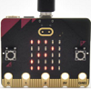

同理，Micro:bit主板的Logo朝上时，LED点阵显示数字3(倒立的3)，Logo朝下示意图如下所示：

当屏幕朝上（指的是LED点阵朝上）时，LED点阵显示数字4。如下图所示：

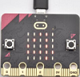

同理，当屏幕朝下（指的是LED点阵朝下）时，LED点阵显示数字5。

当Micro:bit 主板向左倾斜（是指LED点阵先朝上，然后再往左边倾斜）时，LED点阵显示数字6。如下图所示：

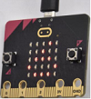

同理，当Micro:bit主板向右倾斜（是指LED点阵先朝上，然后再往右边倾斜）时，LED点阵显示数字7。如下图所示：

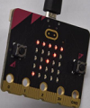

当不小心碰到Micro:bit主板使其从桌面掉落，则为做自由落体运动，此时，Micro:bit主板满足自由落体的条件，则LED点阵显示数字8。（注意：此方法操作时，很容易把micro:bit主板摔坏，不建议操作）

注意：（3g、6g、8g， 如果需要满足此条件，则需要达到3倍，6倍，8倍重力加速度甩动Micro:bit主板。如果你们有兴趣的话，这部分程序可以自己添加）

**5.实验程序2：**

检测加速度在X轴，Y轴，Z轴的不同的值

可以直接加载我们提供的程序，也可以自己通过拖动程序块来编写程序，操作步骤如下：

**（1）寻找代码块**

**（2）完整的代码程序**

**6.实验结果2：** 

按照之前的方式将程序2下载到Micro:bit主板，Micro USB数据线不要拔下来，利用Micro USB数据线上电。

打开CoolTerm，点击Options，选择串行Port，设置COM口和波特率，波特率设置为115200（经过测试，Micro:bit的USB串口通讯波特率是115200），点击OK后，最后点击Connect。CoolTerm串口监视器分别显示了加速度在X轴、Y轴、Z轴的分解，以及加速度的合成(重力加速度及其它外力作用的加速度合成)，先将加速计Z轴朝上，然后再将加速计X轴朝上，最后将加速计Z轴朝上,可得数据变化如下图：

### 第08课 光照强度检测

**1.实验说明：** 

本实验将介绍Micro:bit对外界光照强度的检测，由于Micro:bit并不自带光敏传感器，对外界光照强度的检测是通过LED矩阵进行的，LED矩阵被用来感知周围的光，并反复地将LED转换成输入，并采样电压衰减时间。这样检测出来的光照强度是一个相对值。

**2.准备：**

（1）通过Micro USB线连接Micro:bit主板和电脑。

![Img].(./media/img-20230324143645.png)

（2）打开离线版本或Web版本的MakeCode。 

如果是选择通过导入Hex文件来加载项目，请单击“导入”。

如果要一一拖动代码块，请单击“**新建项目**”。

**3.实验程序：**

可以直接加载我们提供的程序，也可以自己通过拖动程序块来编写程序，操作步骤如下：

**（1）寻找代码块**

**（2）完整代码程序**

**4.实验结果：** 

按照之前的方式将代码下载到Micro:bit主板，Micro USB数据线不要拔下来，利用Micro USB数据线上电。

打开CoolTerm，点击Options，选择串行Port，设置COM口和波特率，波特率设置为115200（经过测试，micro:bit的USB串口通讯波特率是115200），点击OK后，最后点击Connect。这样，CoolTerm串口监视器显示光线亮度级别值。

### 第09课 扬声器

**1.实验说明：**

Micro:bit主板有内置扬声器，这使得在你的项目中添加声音变得非常容易。通过编程使扬声器发出各种各样的音调，例如编写一首歌曲：《欢乐颂》，让扬声器播放出来。

**2.准备：** 

（1）通过Micro USB线连接Micro:bit主板和电脑。

（2）打开离线版本或Web版本的MakeCode。 

如果是选择通过导入Hex文件来加载项目，请单击“导入”。

如果要一一拖动代码块，请单击“**新建项目**”。

**3.实验程序1：** 

发出声音

可以直接加载我们提供的程序，也可以自己通过拖动程序块来编写程序，操作步骤如下：

**（1）寻找代码块**

**（2）完整代码程序**

**4.实验现象1:** 

按照之前的方式将实验程序1下载到Micro:bit主板，利用Micro USB数据线上电，Micro:bit主板上的扬声器发出声音且LED点阵显示音乐标志图案。

**5.实验程序2：**

演奏一首《欢乐颂》歌曲, 歌曲《欢乐颂》的简谱如下：

更多音乐简谱知识的相关链接：[https://en.wikipedia.org/wiki/Numbered_musical_notation](https://en.wikipedia.org/wiki/Numbered_musical_notation)

可以直接加载我们提供的程序，也可以自己通过拖动程序块来编写程序，操作步骤如下：

**（1）寻找代码块**

**（2）完整代码程序**

**6.实验现象2:** 

按照之前的方式将实验程序2下载到Micro:bit主板，利用Micro USB数据线上电，Micro:bit主板上的扬声器播放一首《欢乐颂》歌曲。

### 第10课 触摸感应logo

**1.实验说明：**

如果你有了Micro:bit主板，你可以在你的项目中使用金色的触摸感应logo作为另一个输入，这就像多了一个按钮。触摸感应采用的是电容式触摸传感器，当你手指按下（或触摸）它时，它就能感应到电场的微小变化----就像你的手机或平板电脑屏幕一样。当你触摸它，能控制Micro:bit板实现某个功能。

**2.准备：**

（1）通过Micro USB线连接Micro:bit主板和电脑。

（2）打开离线版本或Web版本的MakeCode。 

如果是选择通过导入Hex文件来加载项目，请单击“导入”。

如果要一一拖动代码块，请单击“**新建项目**”。

**3.实验代码：** 

可以直接加载我们提供的程序，也可以自己通过拖动程序块来编写程序，操作步骤如下：

**（1）寻找代码块**

**（2）完整代码程序**

**4.实验现象：**

按照之前的方式将实验代码下载到Micro:bit板，利用Micro USB数据线上电，手指按住Micro:bit主板上“Logo”标志处，Micro:bit主板上的LED点阵显示“❤”图案；手指松开Micro:bit主板上“Logo”标志处，会出现数字。

### 第11课 麦克风

**1.实验说明：**

Micro:bit 主板有一个内置麦克风，可以测量环境的声音程度。你可以使用它作为一个简单的输入---当你鼓掌时，Micro:bit主板上前面内置麦克风LED指示灯会被打开。它还可以测量声音的强度，所以你可以制作一个噪音等级表或与音乐合拍的迪斯科灯光。麦克风是在Micro:bit 主板的背面，而在前面，你会发现一个内置麦克风LED指示灯，还有紧挨着让声音进入麦克风的孔。当你Micro:bit主板在测量声音级别时，它就会亮起来。

**2.准备：**

（1）通过Micro USB线连接Micro:bit主板和电脑。

（2）打开离线版本或Web版本的MakeCode。 

如果是选择通过导入Hex文件来加载项目，请单击“导入”。

如果要一一拖动代码块，请单击“**新建项目**”。

**3.实验程序1：** 

可以直接加载我们提供的程序，也可以自己通过拖动程序块来编写程序，操作步骤如下：

**（1）寻找代码块**

**（2）完整代码程序**

**4.实验结果1:**  

按照之前的方式将实验程序1下载到Micro:bit板，利用Micro USB数据线上电，当你鼓掌时，Micro:bit 主板上的LED点阵显示“❤”图案；当外界环境安静时，Micro:bit 主板上的LED点阵显示“”图案。

**5.实验程序2：** 

可以直接加载我们提供的程序，也可以自己通过拖动程序块来编写程序，操作步骤如下：

**（1）寻找代码块**

**（2）完整代码程序**

**6.实验结果2**： 

按照之前的方式将实验程序2下载到Micro:bit主板，利用Micro USB数据线上电。

打开CoolTerm，点击Options，选择串行Port，设置COM口和波特率，波特率设置为115200（经过测试，Micro:bit的USB串口通讯波特率是115200），点击OK后，最后点击Connect。CoolTerm串口监视器显示了声音强度值。

### 第12课 Microbit 蓝牙无线通信

**1.实验说明：**

Micro:bit主板了处理器内置蓝牙5.1低功耗的BLE(蓝牙 Low Energy)设备）以及2.4GHz天线，可进行蓝牙无线通信和2.4GHz无线通信。使得Micro:bit主板可以与各种蓝牙设备进行通信，包括智能手机和平板电脑。

在本实验中，主要讲解新款的Micro:bit主板实现蓝牙无线通信功能，我们可以通过连接蓝牙，实现无线传输代码（信号）功能。我们利用一个苹果系统设备（手机/iPad）和Micro:bit 主板连接，实现无线传输功能。设置安卓系统手机实现无线传输方法和苹果系统设备（手机/iPad）类似，这里就不一一介绍了。

**2.准备：**

（1）通过Micro USB线连接Micro:bit主板和电脑。

（2）苹果系统设备（手机/iPad）或安卓系统手机。

**3.实验步骤：**

App下载链接：[https://microbit.org/get-started/user-guide/mobile/](https://microbit.org/get-started/user-guide/mobile/) （安卓系统下载参考链接）

我们以苹果系统设备为例：

（1）如果你的智能手机/iPad是苹果系统的，需要先在电脑上进入网页：[https://www.microbit.org/get-started/user-guide/ble-ios/](https://www.microbit.org/get-started/user-guide/ble-ios/) ，往下翻点击“Download pairing HEX file”下载micro:bit的固件到创建的文件夹中或电脑桌面上，并将下载好的Micro:bit固件烧入Micro:bit主板中。（这一步只针对于苹果系统的智能手机/iPad，安卓系统智能手机/不需要这一步）

（2）在苹果系统设备（手机/iPad）上打开，在App Store的搜索框中输入“micro bit”，然后选中micro:bit 选项，会出现下载界面（如下图所示：），点击“”，就可以下载安装对应的APP。

（3）苹果系统设备（手机/iPad）和Micro:bit主板配对连接。

a.APP安装成功后，打开苹果系统设备（手机/iPad）上的蓝牙。

b.点击打开APP，先确定Micro USB数据线已经将Micro:bit主板和电脑连接上，再点击APP的第一项“**Choose micro:bit**”，开始配对蓝牙。

c.点击“**Pair a new micro:bit**”，开始配对。

d.根据提示，首先同时按住micro:bit主板上的按键A和B，然后按下micro:bit主板后面的复位&电源按钮几秒钟（按键A和B不能松开），再松开复位&电源按钮，micro:bit主板上LED点阵会显示一个密码图案。最后松开micro:bit主板上的按键A和B，接着点击“**Next**”。

e.在苹果系统手机/iPad上设置密码图案，使图案和micro:bit主板上显示的密码图案一样，点击“**Next**”。

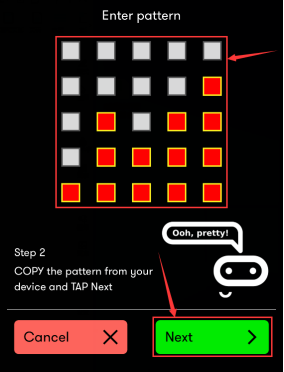

f.点击“**Next**”，出现对话框，在对话框中点击“**Pair**”。几秒钟后，配对成功，同时Micro:bit主板上的LED点阵显示“√”图案。

（4）蓝牙配对成功后，开始利用APP编写代码，并上传代码。

a.点击第二项“Create Code”，进入编程界面，开始编写代码程序。

b. 将代码程序项目名称设置为“1”，点击保存图案“”，保存代码程序。

c.项目代码程序保存成功后，点击第三项“**Flash**”进入上传代码程序界面。默认选择代码程序是刚刚保存的项目名称为“**1**”的代码程序，然后点击“**Flash**”上传代码程序“**1**”。

d.几秒钟后，代码程序“**1**”上传成功，会显示如下图。然后micro:bit主板上的LED点阵显示跳跃的“**心**”对应图案.

## Microbit 机械手臂课程

### 第13课 4自由度机械手臂各个关节转动和控制引脚

**第1小节  4自由度机械手臂各关节的转动方向与舵机角度设置** 

|名称|0°|180°|
| :--: | :--: | :--: |
|舵机1（右侧舵机）|连接舵机1的小摆杆往后下摆|连接舵机1的小摆杆往上前摆|
|舵机2（底座转动舵机）|转到最右边|转到最左边|
|舵机3（爪子处舵机）|机械抓打开|机械爪闭合|
|舵机4（左侧舵机）|连接舵机4的大摆杆往前摆|连接舵机4的大摆杆往后摆|

**第2小节 控制引脚**

|舵机1（右侧舵机）|Micro:bit 16路舵机扩展板|
| :--: | :--: |
|棕线|G|
|红线|V|
|橙线|S(4)|

|舵机2（底座转动舵机）|Micro:bit 16路舵机扩展板|
| :--: | :--: |
|棕线|G|
|红线|V|
|橙线|S(5)|

|舵机3（爪子舵机）|Micro:bit 16路舵机扩展板|
| :--: | :--: |
|棕线|G|
|红线|V|
|橙线|S(6)|

|舵机4（左侧舵机）|Micro:bit 16路舵机扩展板|
| :--: | :--: |
|棕线|G|
|红线|V|
|橙线|S(7)|

|左侧摇杆模块(引脚)|Micro:bit 16路舵机扩展板|
| :--: | :--: |
|Y|P0|
|X|P1|
|V|+3V|
|G|GND|

|右侧摇杆模块(引脚)|Micro:bit 16路舵机扩展板|
| :--: | :--: |
|Y|P2|
|B|P13|
|V|P14|
|G|P15|

### 第14课 舵机转动

**1.实验说明：**  

在前面的机械手臂安装文档中，我们已经设置了舵机角度。舵机是一种可以非常精确地旋转的电机。目前已广泛应用于玩具车、遥控直升机、飞机、机器人等领域。在这个项目中，我们再次来学习一个舵机转动。

**2.元件知识：**

**舵机：** 舵机是一种位置伺服的驱动器，主要是由外壳、电路板、无核心马达、齿轮与位置检测器所构成。其工作原理是由接收机或者单片机发出信号给舵机，其内部有一个基准电路，产生周期为20ms，宽度为1.5ms 的基准信号，将获得的直流偏置电压与电位器的电压比较，获得电压差输出。经由电路板上的IC 判断转动方向，再驱动无核心马达开始转动，透过减速齿轮将动力传至摆臂，同时由位置检测器送回信号，判断是否已经到达定位。适用于那些需要角度不断变化并可以保持的控制系统。当电机转速一定时，通过级联减速齿轮带动电位器旋转，使得电压差为0，电机停止转动。

舵机有多种规格，但它们都有三根连接线，分别是棕色、红色、橙色(不同品牌可能有不同的颜色)。棕色为GND，红色为电源正极，橙色为信号线

舵机的伺服系统由可变宽度的脉冲来进行控制，橙色的控制线是用来传送脉冲的。一般而言，PWM控制舵机的基准信号周期为20ms（50Hz），理论上脉宽应在1ms到2ms之间，对应控制舵机角度是0°～180°。但是，实际上更多控制舵机的脉宽范围是0.5ms 到2.5ms，具体需要自己实际调试下。

经过实测，舵机的脉冲范围为0.65ms~2.5ms。180度舵机，对应的控制关系是这样的：

|高电平时间|舵机角度|基准信号周期时间（20ms）|
| :--: | :--: | :--: |
|0.65ms|0度|0.65ms高电平+19.35ms低电平|
|1.5ms|90度|1.5ms高电平+18.5ms低电平|
|2.5ms|180度|2.5ms高电平+17.5ms低电平|

舵机的规格参数：

|工作电压：|DC 4.8V〜6V|
| :--: | :--: |
|可操作角度范围：|可操作角度范围：|
|脉波宽度范围：|500→2500 μsec|
|外观尺寸：|22.9*12.2*30mm|
|空载转速：|0.12±0.01 sec/60度（DC 4.8V）  0.1±0.01 sec/60度（DC 6V）|
|空载电流：|200±20mA（DC 4.8V）  220±20mA（DC 6V）|
|停止扭力：|1.3±0.01kg·cm（DC 4.8V）  1.5±0.1kg·cm（DC 6V）|
|停止电流：|≦850mA（DC 4.8V）  ≦1000mA（DC 6V）|
|待机电流：|3±1mA（DC 4.8V）  4±1mA（DC 6V）|
|重量:|9±1g (不带舵机轴)|
|使用温度：|-30℃~60℃|

**3.实验接线：**

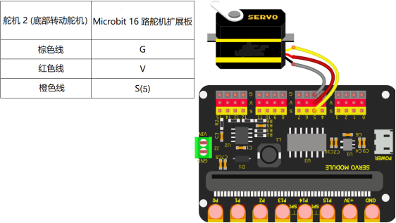

**4.实验准备：** 

（1）将Micro:bit主板正确插入4自由度机械手臂的Microbit 16路舵机扩展板。 

（2）外接电源。 

（3）通过Micro USB线连接Micro:bit和电脑。 

（4）打开离线版本或Web版本的Makecode。

**如果选择通过导入Hex文件来加载项目，则无需手动添加pca9685扩展库。** 

如果选择手动拖动代码，则首先需要添加pca9685扩展库。

**5.实验代码：**

可以直接加载我们提供的程序，也可以自己通过拖动程序块来编写程序程序，操作步骤如下：

**（1）添加库文件**

**特别提醒：如果已经添加好了库文件，此步骤直接跳过。** 

打开MakeCode，先点击右上角的齿轮图标（设置），再点击“扩展”。

或者单击“**高级**”上的“**扩展**”。

在搜索框中输入链接：`https://github.com/keyestudio2019/pxt-pca9685-smallest`，然后单击搜索。 

单击搜索结果pca9685以下载并安装。 该过程可能需要几秒钟。

安装完成后，你可以在左侧找到pca9685的扩展库。

注意：添加到项目中的扩展库仅对该项目有效，而不会出现在其他项目中。 因此，当你创建新项目代码时，需要再次添加pca9685扩展库。

**（2）寻找代码块**

**（3）完整代码程序**

**6.实验结果：**

按照之前的方式将程序下载至Micro: bit主板，利用外接电源供电。上电后，按一下Micro: bit主板上的复位按钮，4自由度机械手臂的舵机2（底座转动舵机）将从右边向左边转动，再从左边向右边转动，循环进行。

### 第15课 按键控制舵机

**1.实验说明：**

在前面的项目实验中，我们已经了解过舵机的控制和Microbit主板上按键的工作原理及应用。那么在这个项目中，我们将学习使用Microbit主板上的按键AB来控制舵机的转动。

**2.实验接线：**

**3.实验准备：** 

（1）将Micro:bit主板正确插入4自由度机械手臂的Microbit 16路舵机扩展板。 

（2）外接电源。

（3）通过Micro USB线连接Micro:bit和电脑。 

（4）打开离线版本或Web版本的Makecode。 

**如果选择通过导入Hex文件来加载项目，则无需手动添加pca9685扩展库。** 

如果选择手动拖动代码，则首先需要添加pca9685扩展库。

**4.实验代码：**  

本程序实现的功能是通过 AB 键控制舵机2（底座转动舵机）左右转，按 A 键的时候4自由度机械手臂的舵机2（底座转动舵机）向左转，按 B 键的时候4自由度机械手臂的舵机2（底座转动舵机）向右转。

可以直接加载我们提供的程序，也可以自己通过拖动程序块来编写程序程序，操作步骤如下：

**（1）添加库文件**

**特别提醒：如果已经添加好了库文件，此步骤直接跳过。**

打开MakeCode，先点击右上角的齿轮图标（设置），再点击“扩展”。

或者单击“**高级**”上的“**扩展**”。

在搜索框中输入链接：`https://github.com/keyestudio2019/pxt-pca9685-smallest`，然后单击搜索。

单击搜索结果pca9685以下载并安装。 该过程可能需要几秒钟。

安装完成后，你可以在左侧找到pca9685的扩展库。

注意：添加到项目中的扩展库仅对该项目有效，而不会出现在其他项目中。 因此，当你创建新项目代码时，需要再次添加pca9685扩展库。

**（2）寻找代码块**

**（3）完整代码程序**

**5.实验结果：**

按照之前的方式将程序下载至Micro: bit主板，利用外接电源供电。上电后，按一下Micro: bit主板上的复位按钮，通过Micro: bit主板上的A B键来控制4自由度机械手臂的舵机2（底座转动舵机）转动，按A键的时候4自由度机械手臂的舵机2（底座转动舵机）向左转，按B键的时候4自由度机械手臂的舵机2（底座转动舵机）向右转。

### 第16课 读取摇杆值

**1.实验说明：**   

摇杆模块是一个有两个模拟输入和一个数字输入的组件。广泛应用于游戏操作、机器人控制、无人机控制等领域。摇杆模块的X、Y引脚就是模拟输入，直接读取其测得的模拟值就可，Z轴（B引脚）是数字按钮，要先设置其引脚为输入状态，再读取测到的数值是1（按下）或0（没按下）。将读取到的值打印到串口监视器。

**2.元件知识：**

**摇杆模块：** 主要是采用PS2 手柄摇杆元件，实际上摇杆模块有3个信号端引脚，模拟3维空间，摇杆模块的引脚分别是GND、VCC、信号端（B、X、Y），其中信号端X、Y模拟空间的X轴和Y轴，控制时，模块的X、Y信号端是连接单片机模拟口，通过控制2个模拟输入值来控制物体在空间X、Y轴的坐标。信号端B模拟空间Z轴，它一般是接数字口，做按键使用。

VCC接单片机电源输出端V/VCC（3.3/5V），GND接单片机G/GND，原始状态下读出电压大约为1.65V/2.5V左右，对于X轴方向，当随箭头方向逐渐按下，读出电压值随着增加，且可以达到最大电压，随箭头相反方向逐渐按下，读出电压值逐渐减少，减少到最小电压；对于Y轴方向，当沿着模块上的箭头方向逐渐按下，读出电压值逐渐减少，减少到最小电压，随箭头相反方向逐渐按下，读出电压值随着增加，且可以达到最大电压；对于Z轴方向，信号端B接数字口，原始状态下输出0，按下输出1。这样，我们可以读取两个模拟值和一个数字口的高低电平情况，判断模块上摇杆的工作状态。

**模块参数：**

输入电压：DC 3.3V ~ 5V

输出信号：X/Y双轴模拟值+Z轴数字信号

适用范围：适用于控制点坐标在平面内的运动，双自由度舵机的控制等。

产品特点：外观精美，摇杆手感优越，操作简单，反应灵敏，使用寿命长。

**3.实验接线：** 

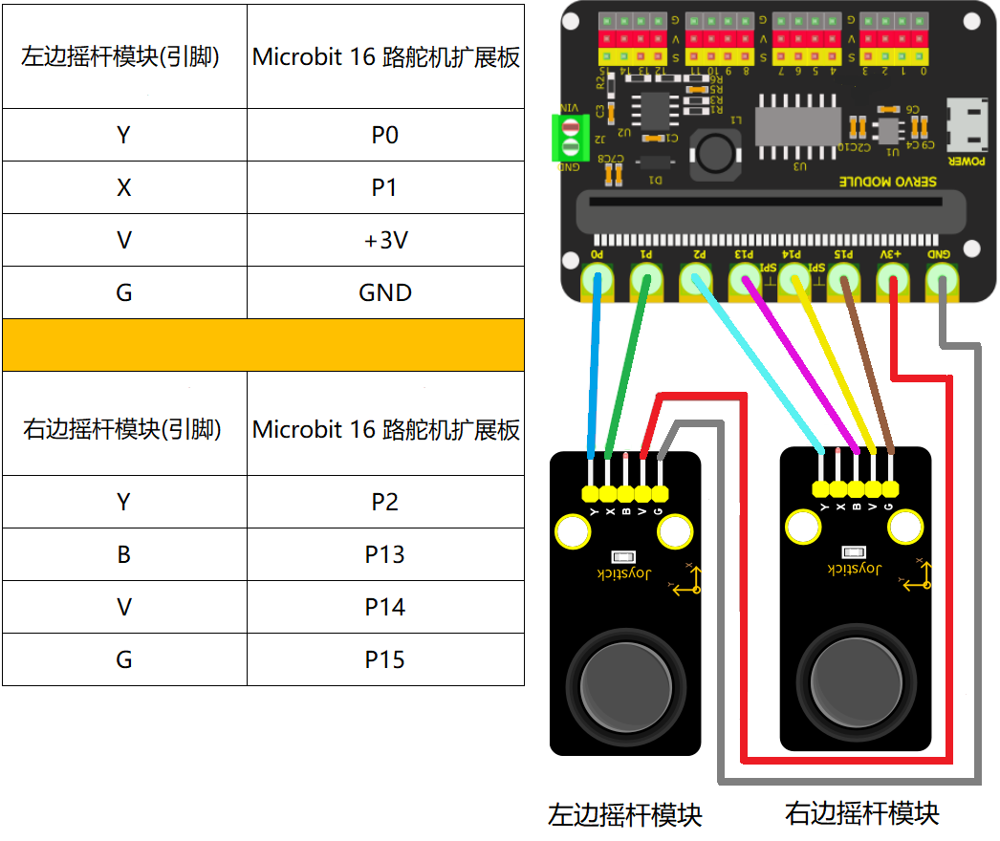

**4.实验准备：**

（1）将Micro:bit主板正确插入4自由度机械手臂的Microbit 16路舵机扩展板。 

（2）外接电源。 

（3）通过Micro USB线连接Micro:bit和电脑。 

（4）打开离线版本或Web版本的Makecode。 

**5.实验代码：**

可以直接加载我们提供的程序，也可以自己通过拖动程序块来编写程序程序，操作步骤如下：

**（1）寻找代码块**

**（2）完整代码程序**

**6.实验结果：**  

按照之前的方式将程序下载至Micro: bit主板，Micro USB数据线不要拔下来，利用Micro USB数据线上电，并且还利用外接电源供电。打开CoolTerm，点击Options，选择串行Port，设置COM口和波特率，波特率设置为115200（经过测试，Micro:bit的USB串口通讯波特率是115200），点击**OK**后，最后点击**Connect**。CoolTerm的串口监视器显示左边摇杆模块的X、Y引脚的模拟值；右摇杆模块的Y引脚的模拟值和右摇杆模块的B引脚（按钮）的数字信号值，摇动左、右摇杆模块及按下、松开右摇杆模块按钮，模拟值和数字信号值会发生变化。如下图：

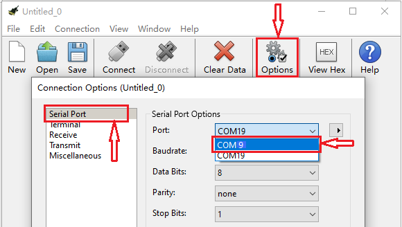

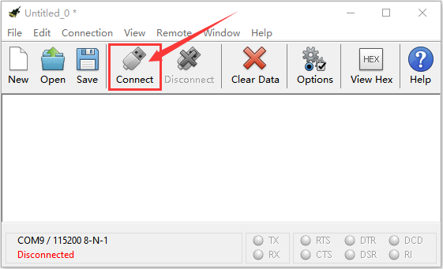

### 第17课 双摇杆控制4自由度机械手臂

**1.实验说明：**

前面课程中我们学习了舵机的基本原理与应用，同时也学习了读取摇杆的值。则在这一课程中，我们将这两个实验结合起来，实现通过利用两个摇杆模块，来控制4自由度机械手臂实现各种运动。

控制时我们先设置开机的姿势；摇杆模块控制4自由度机械手臂的如下表格：

**初始化（即舵机初始角度）**

|舵机4（左侧舵机）：120°|舵机1（右侧舵机）：60°|
| :--: | :--: |
|**舵机2（底座转动舵机）：90°**|**舵机3（爪子处舵机）：60°**|

**左、右摇杆模块控制4自由度机械手臂**

|左摇杆|舵机|右摇杆|舵机|
| :--: | :--: | :--: | :--: |
|x<100|舵机2（底座转动舵机）的角度会逐渐减到30度（即：左摇杆摆到后面时，控制机械手臂转动的舵机2往右转，转到30度就停下。）|y2<100|舵机1（右侧舵机）的角度会逐渐增大到180°（即：右摇杆摆到右边时，连接舵机1的小摆杆往上前摆。）|
|x>900|舵机2（底座转动舵机）逐渐加到150度（即：左摇杆摆到前面时，控制机械手臂转动的舵机2往左转，转到150度就停下。）|y2>800|舵机1（右侧舵机）的角度会逐渐减少到0°（即：右摇杆摆到左边时，连接舵机1的小摆杆往后下摆。）|
|y1>900|舵机4（左侧舵机）的角度会逐渐增加到180°（即：左摇杆摆到左边时，连接舵机4的大摆杆往后摆。）|z=1| 舵机3（爪子处舵机）的角度为180°（即：按住右摇杆的按钮，机械爪闭合。）|
|y1<100|舵机4（左侧舵机）的角度会逐渐减少到35°（即：左摇杆摆到右边时，连接舵机4的大摆杆往前摆。）|z=0| 舵机3（爪子处舵机）的角度为60°（即：松开右摇杆的按钮，机械爪打开。）|

**2.实验接线：**

|舵机1（右侧舵机）|Micro:bit 16路舵机扩展板|
| :--: | :--: |
|棕线|G|
|红线|V|
|橙线|S(4)|

|舵机2（底座转动舵机）|Micro:bit 16路舵机扩展板|
| :--: | :--: |
|棕线|G|
|红线|V|
|橙线|S(5)|

|舵机3（爪子处舵机）|Micro:bit 16路舵机扩展板|
| :--: | :--: |
|棕线|G|
|红线|V|
|橙线|S(6)|

|舵机4（左侧舵机）|Micro:bit 16路舵机扩展板|
| :--: | :--: |
|棕线|G|
|红线|V|
|橙线|S(7)|

|左边摇杆模块(引脚)|Micro:bit 16路舵机扩展板|
| :--: | :--: |
|Y|P0|
|X|P1|
|V|+3V|
|G|GND|

|右边摇杆模块(引脚)|Micro:bit 16路舵机扩展板|
| :--: | :--: |
|Y|P2|
|B|P13|
|V|P14|
|G|P15|

**3.实验准备：**

（1）将Micro:bit主板正确插入4自由度机械手臂的Microbit 16路舵机扩展板。 

（2）外接电源。

（3）通过Micro USB线连接Micro:bit和电脑。 

（4）打开离线版本或Web版本的Makecode。 

如果选择通过导入Hex文件来加载项目，则无需手动添加pca9685扩展库。

如果选择手动拖动代码，则首先需要添加pca9685扩展库。

**4.实验代码：**

可以直接加载我们提供的程序，也可以自己通过拖动程序块来编写程序程序，操作步骤如下：

**（1）添加库文件**

**特别提醒：如果已经添加好了库文件，此步骤直接跳过。**

打开MakeCode，先点击右上角的齿轮图标（设置），再点击“扩展”。

或者单击“**高级**”上的“**扩展**”。

在搜索框中输入链接：`https://github.com/keyestudio2019/pxt-pca9685-smallest`，然后单击搜索。 

单击搜索结果pca9685以下载并安装。 该过程可能需要几秒钟。

安装完成后，你可以在左侧找到pca9685的扩展库。

注意：添加到项目中的扩展库仅对该项目有效，而不会出现在其他项目中。 因此，当你创建新项目代码时，需要再次添加pca9685扩展库。

**（2）寻找代码块**

**（3）完整代码程序**

由于代码比较长，请打开我们提供的示例代码“**第17课：双摇杆控制4自由度机械手臂.hex**”查看.

 **5.实验结果：** 

按照之前的方式将程序下载至Micro: bit主板，利用外接电源供电。上电后，按一下Micro: bit主板上的复位按钮，4自由度机械手臂将处于初始位置，摇动左右两个摇杆模块（左摇杆沿着X轴和Y轴方向摇动；右摇杆沿着Y轴方向摇动及按下、松开右摇杆按钮），即可控制4自由度机械手臂实现各种运动。

### 第18课 读取蓝牙数据

**1.实验说明：**

Micro:bit控制板上自带有蓝牙，可以通过蓝牙方式与Micro:bit通讯，即可以用蓝牙控制Micro:bit主板，或者Micro:bit主板通过蓝牙把信号传回手机或者电脑，我们可以利用Micro:bit主板上自带的蓝牙和手机蓝牙APP通信，利用蓝牙手机APP控制Micro:bit外接设备工作。Micro:bit上自带的蓝牙既支持安卓系统手机，也支持IOS系统设备（手机或iPad）。我们为您提供两种蓝牙APP，适用于安卓系和IOS系统。这两种APP连接Micro:bit蓝牙的方法是类似的。在这一课程中，我们主要介绍蓝牙APP的使用和APP界面上各按钮的功能，并且通过蓝牙APP连接Micro:bit上的蓝牙来读取了APP界面上各按钮发送的控制字符。

**2.安装Android（或iOS）手机/平板蓝牙APP**  

我们设计控制机械手臂的APP控件如下图所示：

App上有10个控制键，当Micro:bit主板上的蓝牙模块与Android（或iOS）系统手机/平板上的蓝牙APP通过蓝牙连接好后，按下控制键，Android（或iOS）系统手机/平板上的APP通过蓝牙就会发送相应的数值。编程时，可以为控制键设置相应的值。所以在实验中，我们会对每个控制键进行测试，在串口监视器中得到相应的值。

**Android系统APP安装步骤：**

1.下载keyes arm.apk文件

A. 我们资料包中有提供Android apk安装包，在下图位置：

现将文件夹中的 keyes arm.apk 文件转移到安卓系统手机或平板电脑上。

B.使用手机浏览器中的扫描功能去扫二维码下载APP。

2.点击keyes arm.apk文件安装“**keyes arm**”APP，界面如下所示：

3.先开启手机/平板的蓝牙，再打开App，点击“CONNECT”进行蓝牙搜索，在搜索结果中寻找“BCC micro:bit”对话框，在“BCC micro:bit”对话框中点击“connect”即可连接蓝牙。当对话框的“connect”变成“is connected”，说明蓝牙连接成功。

**IOS系统APP安装步骤：**

a.打开App Store。

b.在App Store中输入并搜索“keyes arm”，然后点击“Download”下载“keyes arm”APP。

c.“keyes arm”APP的界面如下所示：

d.先开启手机/iPad的蓝牙，再打开App，点击“CONNECT”进行蓝牙搜索，在搜索结果中寻找“BCC micro:bit”对话框，在“BCC micro:bit”对话框中点击“connect”即可连接蓝牙。当对话框的“connect”变成“is connected”，说明蓝牙连接成功。

**3. 准备：**

（1）将Micro:bit主板正确插入Micro:bit 16路舵机扩展板。 

（2）通过Micro USB线连接Micro:bit主板和电脑。 

（3）连接好外接电源。

（4）打开离线版本或Web版本的Makecode。 

 如果选择通过导入 .Hex文件来加载项目，则无需手动添加蓝牙扩展库。

如果选择手动拖动代码，则首先需要添加蓝牙扩展库。点击右上角的齿轮图标（设置），接着点击“**扩展**”。进入库文件选择页面，在文本框输入“**bluetooth**”并点击搜索，出现“**bluetooth**”扩展库并点击“**bluetooth**”扩展库（如果界面有，就不需要通过搜索Bluetooth来找到），如下图所示：

由于micro:bit的硬件原因，蓝牙和无线电不能同时工作，所以它们的扩展库互不兼容。安装蓝牙扩展库时，系统将提示您删除无线电扩展。只需确认移除就行。

**4.实验代码：**

可以直接加载我们提供的程序，也可以自己通过拖动程序块来编写程序程序，操作步骤如下：

**（1）寻找代码块**

**（2）完整代码程序**

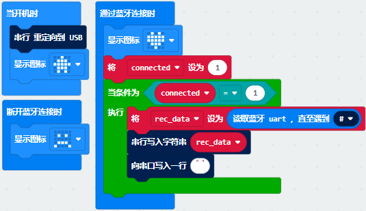

**4.实验结果：**  

（1）实验代码编完之后需要设置，先点击右上角的齿轮图标（设置），再单击“**项目设定**”，在文本框中输入“**第18课：读取蓝牙数据**”后，将“**无需配对**”设置为“**打开**”状态。（如果是直接导入实验代码的就不需要此操作，而自己拖动代码块编写实验代码的就需要此操作）

（2）设置完之后，按照之前的方式将实验代码下载到Micro:bit主板上，Micro USB线不要从Micro:bit主板上拔下来，利用Micro USB线上电。        
 
（3）由于实验代码原因，在MakeCode编辑器中不会出现的“显示控制台设备”，所以读取不了APP界面上各按钮发送的控制字符，这里需要使用CoolTerm程序来读取APP界面上各按钮发送的控制字符。打开CoolTerm，点击Options，选择SerialPort，设置COM口和波特率，波特率设置为115200（经过测试，micro:bit的USB串口通讯波特率是115200），点击OK后，最后点击Connect。这样，对准micro：bit主板按下Android（或iOS）系统手机/平板上APP界面上的各按钮（控件），可以看到CoolTerm串口监视器显示出蓝牙APP界面上各按钮（控件）对应的控制字符，如下图。

经过测试，我们得出了手机/ipad 蓝牙APP上各个按钮（控件）对应的功能，如下图：

### 第19课 蓝牙控制4自由度机械手臂

**1.实验说明：** 

在上一课程中，我们已经介绍了蓝牙APP的使用和各按钮的功能，并且通过蓝牙APP连接Micro:bit上的蓝牙来读取了APP界面上各按钮发送的控制字符，在本课程中，主要是通过蓝牙APP连接Micro:bit上的蓝牙实现APP控制4自由度机械手臂的多种功能。

**2. 实验接线：**

|舵机1（右侧舵机）|Micro:bit 16路舵机扩展板|
| :--: | :--: |
|棕线|G|
|红线|V|
|橙线|S(4)|

|舵机2（底座转动舵机）|Micro:bit 16路舵机扩展板|
| :--: | :--: |
|棕线|G|
|红线|V|
|橙线|S(5)|

|舵机3（爪子处舵机）|Micro:bit 16路舵机扩展板|
| :--: | :--: |
|棕线|G|
|红线|V|
|橙线|S(6)|

|舵机4（左侧舵机）|Micro:bit 16路舵机扩展板|
| :--: | :--: |
|棕线|G|
|红线|V|
|橙线|S(7)|

**3. 准备：** 
                                                                                   
（1）将Micro:bit主板正确插入Micro:bit 16路舵机扩展板。

（2）通过Micro USB线连接Micro:bit主板和电脑。

（3）连接好外接电源。 

（4）打开离线版本或Web版本的Makecode。 

如果选择通过导入文件夹中的 .Hex文件来加载项目，则无需手动添加蓝牙扩展库和pca9685扩展库。

如果选择手动拖动代码，则首先需要添加蓝牙扩展库和pca9685扩展库。

**4.实验代码：** 

**（1）添加库文件**

**特别提醒：如果已经添加好了库文件，此步骤直接跳过。**

打开MakeCode，先点击右上角的齿轮图标（设置），再点击“扩展”。

或者单击“**高级**”上的“**扩展**”。

进入库文件选择页面，在文本框输入“**bluetooth**”并点击搜索，出现“**bluetooth**”扩展库并点击“**bluetooth**”扩展库（如果界面有，就不需要通过搜索Bluetooth来找到），如下图所示：

由于micro:bit的硬件原因，蓝牙和无线电不能同时工作，所以它们的扩展库互不兼容。安装蓝牙扩展库时，系统将提示您删除无线电扩展。只需确认移除就行。

这样，蓝牙扩展库就添加好了，接着添加pca9685扩展库。

打开MakeCode，先点击右上角的齿轮图标（设置），再点击“扩展”。

或者单击“**高级**”上的“**扩展**”。

在搜索框中输入链接：`https://github.com/keyestudio2019/pxt-pca9685-smallest`，然后单击搜索。

单击搜索结果pca9685以下载并安装。 该过程可能需要几秒钟。

安装完成后，你可以在左侧找到pca9685的扩展库。

注意：添加到项目中的扩展库仅对该项目有效，而不会出现在其他项目中。 因此，当你创建新项目代码时，需要再次添加pca9685扩展库。

**（2）实验代码**                                                                              

由于这个代码程序比较复杂，步骤比较多，这里我们就不提供编写代码程序的详细操作步骤，如果你自己有兴趣的话，可以自己拖动代码块来操作下。

我们提供编写好的代码程序，请打开我们提供的示例代码“**第19课：蓝牙控制4自由度机械手臂.hex**”查看，如下图位置：

**5.实验结果：**  

（1）实验代码编完之后需要设置，先点击右上角的齿轮图标（设置），再单击“**项目设定**”，在文本框中输入“**第19课：蓝牙控制4自由度机械手臂**”后，将“**无需配对**”设置为“**打开**”状态。（如果是直接导入实验代码的就不需要此操作，而自己拖动代码块编写实验代码的就需要此操作）

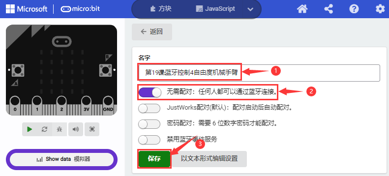

（2）设置完之后，按照之前的方式将实验代码下载到Micro:bit主板上，外接电源，之后打开手机/ipad应用程序“keyes arm”APP，然后按照前面的方法（参照 **第18课 读取蓝牙数据**）完成蓝牙连接，那你就可以操作“keyes arm”APP页面上的按钮（控件）来控制4自由度机械手臂自由工作。

注意：经过测试，我们已经得出了手机/ipad 蓝牙APP上各个按钮（控件）对应的功能，如下图：

