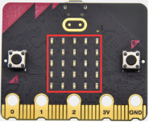
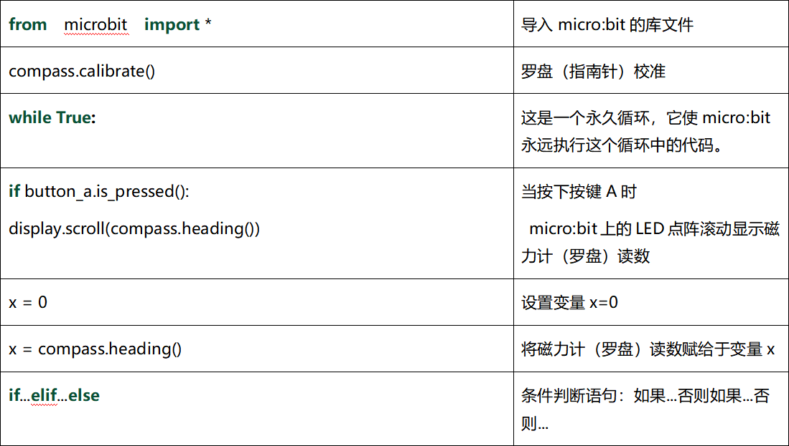

# Python 教程

## Mu 编译器开发环境设置

### 1. 安装 IDE  

**Mu**

Mu的官方网站：[https://codewith.mu/](https://codewith.mu/)

Mu是一个面向初学者程序员的Python代码编辑器，它基于教师和学生。获得Mu最简单和最容易的方法是通过Windows或Mac OSX的官方安装程序(Mu不再支持32位Windows)。目前推荐的版本是Mu 1.1.0-beta 2。建议你们通过每个支持的操作系统的链接更新到这个版本.

**步骤1-确定版本并且下载Mu安装程序：**

先了解您的计算机是Windows系统还是Mac OSX系统；再打开资源管理器，鼠标右键点击”此电脑”，并选择属性，了解您的Windows系统是32位还是64位。


查看系统类别，类型将显示在操作系统下，64位系统或者32位系统：


打开链接：[https://codewith.mu/en/download](https://codewith.mu/en/download) 下载对应的Mu软件版本。


**步骤2-运行安装程序：**

找到你刚刚下载的安装程序（它可能在你的下载文件夹中），双击打开安装程序文件。


这里我们概述了在Windows 系统上安装Mu所需的步骤。

Mac OSX系统安装Mu方法对应链接：[https://codewith.mu/en/howto/1.1/install_macos](https://codewith.mu/en/howto/1.1/install_macos) 。

**步骤3-许可协议**

检查许可证，选择复选框并单击“Install”。


**步骤4-安装**

当Mu在你的电脑上安装时，需要几秒钟。


**第5步-完成**   

安装已成功完成，请单击“**Finish**”关闭安装程序。


**第6步-启动Mu** 

你可以点击开始菜单中的图标启动Mu，也可以在搜索框中输入Mu(下面两种方法都有显示)。在第一次开始时，这可能需要一些时间。


Mu的主界面如下图所示：


### 2. 开发板驱动安装 

Micro:bit是可以免安装USB驱动的。<span style="color: rgb(255, 76, 65);">如果你的电脑已经安装过micro:bit 驱动，就不需要再次安装micro:bit驱动。假如你是首次使用micro:bit主板，则你的电脑需要安装micro:bit驱动。</span>如果你的电脑识别不了Micro:bit主板，则需要安装一下Micro:bit驱动，我们提供有Micro:bit 驱动文件，你可以进入相关文件夹中根据安装说明书进行安装。


下面给Micro:bit主板安装驱动。

首先将Micro:bit主板用Micro USB数据线连接到电脑上，然后鼠标左键双击驱动文件，出现如下页面再点击“**下一页**”。


先点击“**安装**”，几秒种后，安装完成，再点击“**完成**”。这样，驱动安装完成。


安装完成后，点击“**我的电脑**” —>“**属性**”—> “**设备管理器**”, 我们可以看到下图。


### 3. 编译器设置和工具栏介绍                                      

第一次使用时需要设置“模式”为BBC micro:bit。

打开Mu软件，点击菜单栏中的“模式”按钮并在弹出对话框中选择“BBC micro：bit”之后，单击“OK”。


Mu的操作页面请参考官方的介绍：[https://codewith.mu/en/tutorials/1.1/start](https://codewith.mu/en/tutorials/1.1/start)

更多有关使用Mu的教程，请参阅：[https://codewith.mu/en/tutorials/](https://codewith.mu/en/tutorials/)

### 4. 库文件安装  

<span style="color: rgb(255, 76, 65);">特别注意：导入库文件前需要给Micro:bit主板上传一个.py的代码（空代码也是可以的），这里我们是以一个空代码为例。</span>


导入“**PCA9685\.py**”和“**servo\.py**”库文件

Mu保存文件的默认目录是“Mu_code”，它位于用户目录的根目录中。参考文献链接：[https://codewith.mu/en/tutorials/1.0/files](https://codewith.mu/en/tutorials/1.0/files)

例如，在Windows系统中，假设您的系统安装在电脑C驱动器上，则用户名为“Administrator”，那么“mu_code”目录的路径是“C:\Administrator\mu_ code”。在Linux系统上，“mu_code”目录的路径是“~/home/mu_code” .

<span style="color: rgb(0, 209, 0);">进入“mu_code”文件夹。</span>


我们提供的库文件“PCA9685\.py”和“servo\.py”的路径如下：


复制粘贴我们提供的库文件“PCA9685\.py”和“servo\.py”到“mu_code”文件夹中。复制成功后，如下图：


先打开Mu软件并连接Micro:bit主板到电脑，接着点击“**刷入**”按钮烧入一个空的程序代码到Micro:bit主板中。


然后点击“**文件**”按钮，就可以在“**电脑上的文件**”栏的下面方框中看到两个对应的库文件，再分别拖着库文件“PCA9685\.py”和“servo\.py”到Micro:bit主板中。


库文件导入成功后，你点击“**加载**”按钮导入（路径：）<u>..\教程代码+Python库文件\教程代码\Python 代码\Microbit 机械手臂课程</u> 中的程序代码“**第14课 舵机转动\.py**”,然后单击“**检查**”按钮来检查代码是否有错误。如果一行出现光标或下划线，则表明该行的程序有错误。


但是，单击“**检查**”按钮来检查代码是否有错误时，即使代码没有错误时也会出现如下提示语，这提示语只是一些警告语，而不是代码错误提示语。也就是说整个代码是没有错误的。


确定程序代码无误之后，你还需要确定Micro USB线已经将Micro:bit主板连接到电脑，然后单击“**刷入**”按钮将代码下载到Micro:bit主板。


如果点击“**刷入**”按钮后程序代码错误或实验现象错误，请确认你是否已经导入好我们提供给Micro:bit主板的库文件“PCA9685\.py”和“servo\.py”。

<span style="color: rgb(255, 76, 65);">特别注意: 如果您在micro:bit板上下载了其他程序，但库文件“PCA9685\.py”和“servo\.py”程序除外。在使用Micropython编程之前，您需要将库文件导入到Micro:bit主板。如果您始终使用相同的 Micro:bit主板进行Micropython编程，则无需多次将库文件发送到Micro:bit主板；反之，就需要再次将库文件发送到Micro:bit主板。</span> 

### 5. 添加代码到编译器  

这里我们以基础教程的“**第1课 心跳\.py**”为例，打开（路径：）<u>..\教程代码+Python库文件\教程代码\Python 代码\Microbit 基础课程</u> 中的程序代码文件“**第1课 心跳\.py**”。


除了上述Mu软件加载（导入）代码方法之外，还有一种更简单的加载代码方法：先打开 Mu 编辑器 软件，然后选中“**第1课 心跳\.py**”文件，并继续按下鼠标左键，将选中的文件拖动到Mu软件中。如下图所示：


成功加载如下所示。你也可以自己在编辑窗口输入代码。（<span style="color: rgb(255, 76, 65);">注意！所有英文及符号均须以英文填写，最后一行必须有空格。</span>）


### 6.下载代码到Micro:bit主板                                    

通过Micro USB线连接Micro:bit主板和电脑，点击“**刷入**”按钮将代码下载到Micro:bit主板。


如果代码有错误，也可以将代码成功下载到Micro:bit主板，但无法正常工作。如果sleep写为sleeps，点击“**刷入**”按钮，代码也会被下载到Micro:bit主板。


但是，下载完成后，Micro:bit主板正面的led点阵提示一些错误信息，以及错误的行号。点击“**REPL**”按钮之后，再按下Micro:bit主板的重置按钮（背面的复位按钮，不是A、B按键），错误信息将显示在REPL框中，如下所示：


再次单击“**REPL**”按钮，将关闭REPL模式，然后你就可以刷新新代码了。为了确保代码正确，完成代码后，单击“**检查**”按钮检查代码是否有错误。如下图所示，点击“**检查**”按钮，然后Mu将指示代码的错误。


根据错误提示，正确修改代码。然后再点击“**检查**”按钮，Mu在下面的栏上显示没有问题。


有关使用Mu的更多教程，请参阅：[https://codewith.mu/en/tutorials/](https://codewith.mu/en/tutorials/)


## Microbit 基础课程


### 第01课 心跳

<span style="color: rgb(255, 76, 65);">Micro:bit 基础课程是使用Micro:bit主板自带的传感器模块和LED点阵。</span>

**1.实验说明：**

首先先来练习一个不需要其他辅助元件，只需要一块Micro:bit主板，一根Micro USB数据线与一台计算机的简单实验，让Micro:bit主板上的点阵显示“心跳”，这是一个让Micro:bit主板和计算机通信的实验，这也是一个入门实验，希望可以带领大家进入Micro:bit的魔幻世界。

**2.准备：**

（1）通过Micro USB线连接Micro:bit主板和电脑。


（2）打开离线版本的Mu软件。

**3.课程代码：**

可以直接在Mu编译器上传教程中的代码，也可以手动在Mu编译器编写代码。


```python
from microbit import *

while True:
    display.show(Image.HEART)
    sleep(500)
    display.show(Image.HEART_SMALL)
    sleep(500)
```

**4. 代码解释：**

|代码块|解释|
| :--: | :--: |
|from  microbit  import *|导入micro：bit的库文件|
|while True:|这是一个永久循环，它使micro：bit永远执行这个循环中的代码。|
|display.show(Image.HEART)|micro：bit上的LED点阵显示“”图案|
|sleep(500)|延时500毫秒|
|display.show(Image.HEART_SMALL)|micro：bit上的LED点阵显示“”图案|

**5. 实验结果：**

按照之前的方式将代码下载到micro：bit主板，micro USB数据线不要拔下来，利用micro USB数据线上电，micro:bit主板上的LED点阵屏切换显示“”图案和“”图案，循环进行。


<span style="color: rgb(255, 76, 65);">如果存在下载问题，请断开micro USB线和Micro：bit，然后重新连接它们并重新打开编译器，尝试再次下载。</span>

**6. 扩展小知识：**

 可以看到“Image.HEART”等于；“Image.HEART_SMALL”等于

这其实是microbit里面写好的了，直接使用就即可。

以下是内置图像的列表，如果感兴趣，可以选择以下某个内置图像替换上图代码中的函数show（）里面的“Image.HEART”就行。

• Image.HEART 
• Image.HEART_SMALL 
• Image.HAPPY 
• Image.SMILE 
• Image.SAD 
• Image.CONFUSED 
• Image.ANGRY 
• Image.ASLEEP 
• Image.SURPRISED 
• Image.SILLY 
• Image.FABULOUS 
• Image.MEH 
• Image.YES 
• Image\.NO 
• Image.CLOCK12, Image.CLOCK11, Image.CLOCK10, Image.CLOCK9, Image.CLOCK8, Image.CLOCK7, Image.CLOCK6, Image.CLOCK5, Image.CLOCK4, Image.CLOCK3, Image.CLOCK2,Image.CLOCK1 
• Image.ARROW_N, Image.ARROW_NE, Image.ARROW_E, Image.ARROW_SE, Image.ARROW_S, Image.ARROW_SW, Image.ARROW_W, Image.ARROW_NW 
• Image.TRIANGLE 
• Image.TRIANGLE_LEFT 
• Image.CHESSBOARD 
• Image.DIAMOND 
• Image.DIAMOND_SMALL 
• Image.SQUARE 
• Image.SQUARE_SMALL 
• Image.RABBIT 
• Image.COW 
• Image.MUSIC_CROTCHET 
• Image.MUSIC_QUAVER 
• Image.MUSIC_QUAVERS 
• Image.PITCHFORK 
• Image.PACMAN 
• Image.TARGET 
• Image.TSHIRT 
• Image.ROLLERSKATE 
• Image.DUCK 
• Image.HOUSE 
• Image.TORTOISE 
• Image.BUTTERFLY 
• Image.STICKFIGURE 
• Image.GHOST 
• Image.SWORD 
• Image.GIRAFFE 
• Image.SKULL 
• Image.UMBRELLA 
• Image.SNAKE，Image.ALL_CLOCKS，Image.ALL_ARROWS


更多的控制，请参考Micro:bit官方的python库：

[http://microbit-micropython.readthedocs.io/en/latest/index.html](http://microbit-micropython.readthedocs.io/en/latest/index.html)

### 第02课 LED点阵中单个LED显示



**1. 实验说明：**

Micro:bit主板的LED点阵共由25个发光二极管组成，5个一组，分别对应X和Y方向，形成一个5×5的矩阵，且每个发光二极管是放置在行线（X）和列线（Y）的交叉点上，我们可以通过设置坐标点来实现对25个LED中某一个LED的控制。例如，想要LED点阵中第1行第1个LED点亮，可以设置坐标点为（0，0）；第1行第3个LED点亮，可以设置坐标点为（2，0）；第1列第5个LED点亮，可以设置坐标点为（0，4）；第3列第2个LED点亮，可以设置坐标点为（2，1），依此类推。


**2. 准备：**

（1）通过Micro USB线连接Micro:bit主板和电脑。


（2）打开离线版本的Mu软件。

**3. 课程代码：**

可以直接在Mu编译器上传教程中的代码，也可以手动在Mu编译器编写代码。


```python
from microbit import *

val1 = Image("09000:""00000:""00000:""00000:""00000:")
val2 = Image("00000:""00000:""00000:""00000:""00090:")
val3 = Image("00000:""00000:""00000:""00000:""00000:")

while True:
    display.show(val1)
    sleep(500)
    display.show(val3)
    sleep(500)
    display.show(val2)
    sleep(500)
    display.show(val3)
    sleep(500)
```
**4. 代码解释：**

|代码块|解释|
| :--: | :--: |
|from  microbit  import *|导入micro：bit的库文件|
|val1 = Image("09000:""00000:""00000:""00000:""00000:")|将Image()赋给于变量val1(micro:bit上的LED点阵中每个LED像素可以设置为十个值的其中一个。如果像素设置为 0 (zero) ，表示处于关闭状态，从字面上理解，即为0亮度。而设置为 9 ，表示亮度最强。 1 到 8 代表关闭状态 (0) 和 最强亮度(9)之间的亮度级别.)|
|while True:|这是一个永久循环，它使micro：bit永远执行这个循环中的代码。|

**5. 实验结果：**

按照之前的方式将代码下载到Micro:bit主板，Micro USB数据线不要拔下来，利用Micro USB数据线上电，我们就可以看到切换坐标点(1,0)的LED的亮灭状态，持续0.5s，再次切换坐标点(1,0)的LED的亮灭状态，持续0.5s；点亮坐标点(3,4)的LED，持续0.5s，熄灭坐标点(3,4)的LED，持续0.5s。循环进行。


### 第03课 5×5 LED点阵图案显示


**1. 实验说明：**

点阵在我们生活中很常见，很多都有用到它，比如LED广告显示屏，电梯显示楼层，公交车报站等等。

Micro：bit主板的LED点阵共由25个发光二极管组成，上一课我们已经讲过通过设置坐标点来实现对LED点阵的25个LED中的某个LED的控制，这样可以通过设置多个坐标点控制多个LED的亮灭使得LED点阵能够显示图案、数字、字符串。我们也可以在特定代码中通过点击 LED点阵的灰白色小正方形点亮 LED点阵对应的LED来实现LED点阵显示图案、数字、字符串。除了上述方法还可以使用自定义图案使LED点阵显示图案。

**2. 准备：**

（1）通过Micro USB线连接Micro:bit主板和电脑。


（2）打开离线版本的Mu软件。

**3. 课程代码1：**

可以直接在Mu编译器上传教程中的代码，也可以手动在Mu编译器编写代码。


```python
from microbit import *

val = Image("00900:""00900:""90909:""09990:""00900")

display.show(val)
```
**4.实验结果1：**

按照之前的方式将代码1下载到Micro:bit主板，Micro USB数据线不要拔下来，利用Micro USB数据线上电，我们就可以看到Micro:bit主板的5×5 LED点阵显示“向下”图案。

**5. 课程代码2：**

可以直接在Mu编译器上传教程中的代码，也可以手动在Mu编译器编写代码。


```python
from microbit import *
val = Image("00900:""00900:""90909:""09990:""00900")
display.show('1')
sleep(500)
display.show('2')
sleep(500)
display.show('3')
sleep(500)
display.show('4')
sleep(500)
display.show('5')
sleep(500)
display.show(val)
sleep(500)
display.scroll("hello!")
sleep(200)
display.show(Image.HEART)
sleep(500)
display.show(Image.ARROW_NE)
sleep(500)
display.show(Image.ARROW_SE)
sleep(500)
display.show(Image.ARROW_SW)
sleep(500)
display.show(Image.ARROW_NW)
sleep(500)
display.clear()
```

**6.实验结果2：**

用同样的方法将代码2下载到Micro:bit主板，Micro USB数据线不要拔下来，利用Micro USB数据线上电，我们就可以看到Micro:bit主板的5×5 LED点阵开始显示数字1、2、3、4、5，然后循环显示“向下”图案、字符串“Hello!”、“心”图案、“东北”方向图案、“东南”方向图案、“西南”方向图案和“西北”方向图案。 

**7. 代码解释：**

|代码块|解释|
| :--: | :--: |
|from  microbit  import *|导入micro：bit的库文件|
|val = Image("09000:""00000:""00000:""00000:""00000:") |将Image()赋给于变量val|
|display.show(val) |micro:bit上的LED点阵屏显示向下“→”图案|
|display.show('1') |micro:bit上的LED点阵屏显示数字“1”|
|sleep(500)|延时500毫秒|
|display.scroll("hello!")|micro:bit上的LED点阵屏滚动显示字符串“hello!”|
|display.show(Image.HEART) |micro:bit上的LED点阵屏显示“❤”图案|
|display.show(Image.ARROW_NE)|micro:bit上的LED点阵屏显示指向“东北”方向图案|
|display.clear()|micro:bit上的LED点阵屏清屏|


### 第04课 可编程按键

**1.实验说明：**  

  

按键可以控制电路的通断，把按键接入电路中，不按下按键的时候电路是断开的，一按下按键电路就通啦，但是松开之后就又断了。可是为什么按下才通电呢？这得从按键的内部构造说起。没按下之前，电流从按键的一端过不去另一端，按键的两端就像两座山，中间隔着一条河，我们在这座山过不去另一座山；按下的时候，按键内部的金属片把两边连接起来让电流通过，就像搭了一座桥，把两座山连接起来。

按键内部结构如图：，未按下按键之前，1、2就是导通的，3、4也是导通的，但是1、3或1、4或2、3或2、4是断开（不通）的；只有按下按键时，1、3或1、4或2、3或2、4才是导通的。

Micro:bit主板有三个按键，反面的是复位按钮，正面的是两个可编程按键，通过对两个可编程按键组合可以有三种组合，作为输入元件。我们结合上节课的LED点阵，一起来学习按键吧。我们做一个按键三连，分别按A、B和AB同时按，对应显示屏分别显示A、B和AB。

**2. 准备：**

（1）通过Micro USB线连接Micro:bit主板和电脑。


（2）打开离线版本的Mu软件。

**3. 课程代码1：**

按下Micro:bit主板上的按键A，按键B和按键A+B，让Micro:bit上LED点阵显示字符串。

可以直接在Mu编译器上传教程中的代码，也可以手动在Mu编译器编写代码。


```python
from microbit import *

while True:
    if button_a.is_pressed():
        display.show("A")
    elif button_a.is_pressed() and button_b.is_pressed():
        display.scroll("AB")
    elif button_b.is_pressed():
        display.show("B")
```
**4. 实验结果1**：

按照之前的方式将代码1下载到Micro:bit主板，Micro USB数据线不要拔下来，利用Micro USB数据线上电。按下Micro:bit主板上正面按键A，我们可以看到5×5 LED点阵显示字符“A”；按下Micro:bit主板上正面按键B，我们可以看到5×5 LED点阵显示字符“B”；同时按下Micro:bit主板上正面按键A和B，我们就可以看到5×5 LED点阵显示字符“AB”。

**5. 课程代码2：**

按下Micro:bit主板上按键A和按键B，对应的增加和减少条形图高度，表现为LED点阵亮的行数对应的增加和减少。

可以直接在Mu编译器上传教程中的代码，也可以手动在Mu编译器编写代码。


```python
from microbit import *
a = 0
b = 0
val1 = Image("00000:""00000:""00000:""00000:""00900")
val2 = Image("00000:""00000:""00000:""00900:""99999")
val3 = Image("00000:""00000:""00900:""99999:""99999")
val4 = Image("00000:""00900:""99999:""99999:""99999")
val5 = Image("00900:""99999:""99999:""99999:""99999")
val6 = Image("99999:""99999:""99999:""99999:""99999")
display.show(val1)

while True:
    while button_a.is_pressed() == True:
        sleep(10)
        if button_a.is_pressed() == False:
            a = a + 1
            if(a >= 5):
                a = 5
            break
    while button_b.is_pressed() == True:
        sleep(10)
        if button_b.is_pressed() == False:
            a = a - 1
            if(a <= 0):
                a = 0
            break
    if a == 0:
        display.show(val1)
    if a == 1:
        display.show(val2)
    if a == 2:
        display.show(val3)
    if a == 3:
        display.show(val4)
    if a == 4:
        display.show(val5)
    if a == 5:
        display.show(val6)
```
**6.实验结果2：**

按照之前的方式将代码2下载到Micro:bit主板，Micro USB数据线不要拔下来，利用Micro USB数据线上电。按下Micro:bit主板上正面按键A，条形图高度值增加，表现为LED点阵亮的行数增加；按下正面按键B，减少条形图高度，表现为LED点阵亮的行数减少。

**7. 代码解释：**


### 第05课 学习测温度

**1.实验说明：**

Micro:bit主板实际上并不带温度传感器，而是采用nRF52833芯片内置的温度传感器进行温度检测，所以检测的温度更接近芯片的温度，可能与周围环境温度存在一定的误差。在这一课程中，我们先利用该传感器测试当前环境中的温度，并将测试结果在显示数据(设备)中显示，再通过设置该传感器检测的温度范围来控制LED点阵显示不同的图案。

<span style="color: rgb(255, 76, 65);">注意：Micro:bit主板的温度传感器在这里：</span>


**2. 准备：**

（1）通过Micro USB线连接Micro:bit主板和电脑。


（2）打开离线版本的Mu软件。

**3. 课程代码1：**

Micro:bit检测温度

可以直接在Mu编译器上传教程中的代码，也可以手动在Mu编译器编写代码。


```python
from microbit import *

while True:

    Temperature = temperature()

    print("Temperature:", Temperature, "C")

    sleep(500)
```
**4. 实验结果1：**

按照之前的方式将代码1下载到Micro:bit主板，Micro USB数据线不要拔下来，利用Micro USB数据线上电，先点击“REPL”按钮，再按一下Micro:bit后面的复位按钮，这样，BBC Microbit REPL窗口打印并显示了Micro:bit的温度传感器检测到当前环境中的温度值，如下图：（<span style="color: rgb(255, 76, 65);">这里的字母C表示摄氏温度单位，而摄氏温度单位（℃）会导致乱码</span>）


**5. 课程代码2：**

可以直接在Mu编译器上传教程中的代码，也可以手动在Mu编译器编写代码。


```python
from microbit import *

while True:

    if temperature() >= 35:
        display.show(Image.HEART)

    else:
        display.show(Image.HEART_SMALL)
```

**6.实验结果2：**

按照之前的方式将程序2下载到Micro:bit主板，Micro USB数据线不要拔下来，利用Micro USB数据线上电，外界环境中的温度小于35℃时，Micro:bit主板的5×5LED点阵中显示图案，用手按住Micro:bit主板的温度传感器，温度大于等于35℃时，5×5LED点阵中显示图案。

**7. 代码解释：**


### 第06课 地磁传感器


**1.实验说明：**

本实验项目主要介绍Micro:bit地磁传感器的使用，地磁传感器除了检测地磁场强度外，还能当作指南针确定方向，同时也是航姿参考系统(AHRS)的重要组成部分。Micro:bit V2主板采用的是LSM303AGR 地磁传感器，磁场动态范围为±50 gauss。在micro:bit V2主板中，磁力检测、指南针积木块均用到了磁力计栏，本实验中，将先介绍指南针，然后查看磁力计原始数据。常见的指南针主要部件是一根磁针，在地磁场的作用下可以转动并指向地磁北极（地磁北极是在地理南极附近），用来辨别方向。

micro:bit内部的一个地磁传感器（磁力计、指南针），我们可以读取这个磁力计的读数来判断方位，得到相对于北磁极的数值。返回值是0到360之间的数值，在磁力计首次开始工作（带到新位置后）时系统会自动要求我们对micro:bit主板校准，正确的校准方式是旋转micro:bit主板。需要注意的是，附近要是有金属物件可能会影响读数和校准准确性。

**2. 准备：**

（1）通过Micro USB线连接Micro:bit主板和电脑。


（2）打开离线版本的Mu软件。

**3. 课程代码1：**

按下按键A的时候，可以在屏幕上显示磁力计的读数。

可以直接在Mu编译器上传教程中的代码，也可以手动在Mu编译器编写代码。


```python
from microbit import *

compass.calibrate()

while True:

    if button_a.is_pressed():
        display.scroll(compass.heading())
```

程序说明：首先必须对Micro:bit进行校准，因为每个地方地磁场不同，对结果有比较大的的影响，如果是第一次使用指南针，Micro:bit会自动提示需要校准。

**4.实验结果1:** 

按照之前的方式将程序1下载至Micro: bit主板，micro USB数据线不要拔下来，利用Micro USB数据线上电，按下Micro:bit主板上正面按键A时，Micro:bit主板首先提示校准，屏幕(LED点阵)提示:“TILT TO FILL SCREEN”,然后进入校准界面，校准方式为：旋转Micro:bit主板，使得屏幕(LED点阵)画一个封闭的正方形（25个LED都点亮），如下图所示：


当封闭的正方形画好后，会显示一个“笑脸”图案，表示校准完成。
校准完成后，当每次按下按键A的时候，直接在屏幕上显示磁力计读数，北、东、南、西对应0°、90°、180°、270°。

**5. 课程代码2：**

朝不同的方向旋转磁力计，LED点阵显示对应的方向图案。

可以直接在Mu编译器上传教程中的代码，也可以手动在Mu编译器编写代码。


```python
from microbit import *
compass.calibrate()
x = 0
while True:
    x = compass.heading()
    if x >= 293 and x < 338:
        display.show(Image("00999:""00099:""00909:""09000:""90000"))
    elif x >= 23 and x < 68:
        display.show(Image("99900:""99000:""90900:""00090:""00009"))
    elif x >= 68 and x < 113:
        display.show(Image("00900:""09000:""99999:""09000:""00900"))
    elif x >= 113 and x < 158:
        display.show(Image("00009:""00090:""90900:""99000:""99900"))
    elif x >= 158 and x < 203:
        display.show(Image("00900:""00900:""90909:""09990:""00900"))
    elif x >= 203 and x < 248:
        display.show(Image("90000:""09000:""00909:""00099:""00999"))
    elif x >= 248 and x < 293:
        display.show(Image("00900:""00090:""99999:""00090:""00900"))
    else:
        display.show(Image("00900:""09990:""90909:""00900:""00900"))
```
朝不同的方向旋转磁力计，LED点阵显示对应的方向图案。

如图所示，如果读数在292.5和337.5之间，就让显示屏显示一个指向右上方的箭头，由于代码里不能输入0.5，所以取的判断数值是293和338。之后再加入其它逻辑加载完成后，如下图所示：


**6.实验结果2：** 

按照之前的方式将程序2下载到Micro:bit主板，Micro USB数据线不要拔下来，利用Micro USB数据线上电，提示校准（校准方法请参考:上面程序1部分），校准完成后，旋转移动Micro:bit主板，可以看到Micro:bit主板上LED点阵显示各方向图案。

**7. 代码解释：**




### 第07课 加速度传感器


**1.实验说明：**

Micro:bit V2主板内置有LSM303AGR 重力加速度传感器（加速度计），其具有8/10/12 bits的分辨率，程序可设置量程为1g、2g、4g,、8g。

我们常使用加速度计来检测机器的姿态。

在本实验项目中，将介绍加速度传感器（加速度计）对几个特殊姿态的检测，之后来查看加速度传感器输出的三轴原始数据。

**2. 准备：**

（1）通过Micro USB线连接Micro:bit主板和电脑。


（2）打开离线版本的Mu软件。

**3. 课程代码1：**

对Micro:bit不同的操作，LED点阵显示对应的数字。

可以直接在Mu编译器上传教程中的代码，也可以手动在Mu编译器编写代码。


```python
from microbit import *

while True:
    gesture = accelerometer.current_gesture()

    if gesture == "shake":
        display.show("1")
    if gesture == "up":
        display.show("2")
    if gesture == "down":
        display.show("3")
    if gesture == "face up":
        display.show("4")
    if gesture == "face down":
        display.show("5")
    if gesture == "left":
        display.show("6")
    if gesture == "right":
        display.show("7")
    if gesture == "freefall":
        display.show("8")
```
**4.实验结果1:**    

按照之前的方式将程序1下载到Micro:bit主板，利用Micro USB数据线上电，将Micro:bit主板晃动，则可见Micro:bit显示数字1（表明只要有晃动，无论朝哪个方向晃动，该条件都将满足）。

当Micro:bit主板的Logo朝上时，LED点阵显示数字2，Logo朝上示意图如下所示：


同理，Micro:bit主板的Logo朝上时，LED点阵显示数字3(倒立的3)，Logo朝下示意图如下所示：


当屏幕朝上（指的是LED点阵朝上）时，LED点阵显示数字4。如下图所示：


同理，当屏幕朝下（指的是LED点阵朝下）时，LED点阵显示数字5。

当Micro:bit 主板向左倾斜（<span style="color: rgb(255, 76, 65);">是指LED点阵先朝上，然后再往左边倾斜</span>）时，LED点阵显示数字6。如下图所示：


同理，当Micro:bit主板向右倾斜（<span style="color: rgb(255, 76, 65);">是指LED点阵先朝上，然后再往右边倾斜</span>）时，LED点阵显示数字7。如下图所示：


当不小心碰到Micro:bit主板使其从桌面掉落，则为做自由落体运动，此时，Micro:bit主板满足自由落体的条件，则LED点阵显示数字8。（<span style="color: rgb(255, 76, 65);">注意：此方法操作时，很容易把micro:bit主板摔坏，不建议操作</span>）

<span style="color: rgb(255, 76, 65);">注意：（3g、6g、8g， 如果需要满足此条件，则需要达到3倍，6倍，8倍重力加速度甩动Micro:bit主板。如果你们有兴趣的话，这部分程序可以自己添加）</span>


**5.实验程序2：**

检测加速度在X轴，Y轴，Z轴的不同的值

可以直接在Mu编译器上传教程中的代码，也可以手动在Mu编译器编写代码。


```python
from microbit import *

while True:

    x = accelerometer.get_x()

    y = accelerometer.get_y()

    z = accelerometer.get_z()

    print("x, y, z:", x, y, z)

    sleep(100)
```

**6. 实验结果2：**

按照之前的方式将代码2成功下载到Micro:bit之后，Micro USB数据线不要拔下来，利用Micro USB数据线上电。先点击“REPL”按钮，再按一下Micro:bit后面的复位按钮，这样，BBC microbit REPL窗口打印并显示了Micro:bit的加速度在X轴、Y轴、Z轴的分解，可得数据变化如下图：


**7. 代码解释：**


### 第08课 光照强度检测


**1.实验说明**：

本实验将介绍Micro:bit对外界光照强度的检测，由于Micro:bit并不自带光敏传感器，对外界光照强度的检测是通过LED矩阵进行的，LED矩阵被用来感知周围的光，并反复地将LED转换成输入，并采样电压衰减时间。这样检测出来的光照强度是一个相对值。

**2. 准备：**

（1）通过Micro USB线连接Micro:bit主板和电脑。


（2）打开离线版本的Mu软件。

**3. 课程代码：**

可以直接在Mu编译器上传教程中的代码，也可以手动在Mu编译器编写代码。


```python
from microbit import *

while True:
    Lightintensity = display.read_light_level()
    print("Light intensity:", Lightintensity)
    sleep(100)
```

**4.实验结果：**

按照之前的方式将代码下载到Micro:bit主板，Micro USB数据线不要拔下来，利用Micro USB数据线上电。先点击“REPL”按钮，再按一下micro:bit后面的复位按钮，这样，BBC Microbit REPL窗口打印并显示了Micro:bit中光线传感器检测到的环境中光线强度值，如下图所示。当用手全部遮住Micro:bit的LED点阵，亮度级别约为0；然后将Micro:bit的LED点阵放置于光照下，随着环境中的光线强度增强时，亮度级别值也在逐渐增大；反之，亮度级别值在逐渐减少。


**5.代码说明：**

|代码块|解释|
| :--: | :--: |
|from  microbit  import *|导入micro：bit的库文件|
|while True:|这是一个永久循环，它使micro：bit永远执行这个循环中的代码。|
|Lightintensity = display.read_light_level()|将display.read_light_level()赋给于变量Lightintensity|
|print("Light intensity:", Lightintensity)|BBC microbit REPL窗口打印光线传感器检测到的光线亮度级别值|

### 第09课 扬声器


**1.实验说明：**

Micro:bit主板有内置扬声器，这使得在你的项目中添加声音变得非常容易。通过编程使扬声器发出各种各样的音调，例如编写一首歌曲：《欢乐颂》，让扬声器播放出来。


**2. 准备：**

（1）通过Micro USB线连接Micro:bit主板和电脑。


（2）打开离线版本的Mu软件。


**3. 课程代码：**

可以直接在Mu编译器上传教程中的代码，也可以手动在Mu编译器编写代码。


```python
from microbit import *

import audio

display.show(Image.MUSIC_QUAVER)

while True:
    audio.play(Sound.GIGGLE)
    sleep(1000)
    audio.play(Sound.HAPPY)
    sleep(1000)
    audio.play(Sound.HELLO)
    sleep(1000)
    audio.play(Sound.YAWN)
    sleep(1000)
```

**4. 实验结果：**

代码成功下载到Micro:bit主板之后，Micro USB数据线不要拔下来，利用Micro USB数据线上电，Micro:bit主板上的扬声器发出声音且LED点阵显示音乐标志图案。


**5.代码说明：**

|代码块|解释|
| :--: | :--: |
|from  microbit  import *|导入micro：bit的库文件|
|import audio|导入audio库文件|
|while True:|这是一个永久循环，它使micro：bit永远执行这个循环中的代码。|
|audio.play(Sound.GIGGLE)|发出giggle的声音|


### 第10课 触摸感应logo


**1.实验说明：**

如果你有了Micro:bit主板，你可以在你的项目中使用金色的触摸感应logo作为另一个输入，这就像多了一个按钮。触摸感应采用的是电容式触摸传感器，当你手指按下（或触摸）它时，它就能感应到电场的微小变化----就像你的手机或平板电脑屏幕一样。当你触摸它，能控制Micro:bit板实现某个功能。


**2. 准备：**

（1）通过Micro USB线连接Micro:bit主板和电脑。


（2）打开离线版本的Mu软件。


**3. 课程代码：**

可以直接在Mu编译器上传教程中的代码，也可以手动在Mu编译器编写代码。


```python
from microbit import *
time = 0
start = 0
running = False

while True:

    if button_a.was_pressed():
        running = True
        start = running_time()
    if button_b.was_pressed():
        if running:
            time += running_time() - start
        running = False
    if pin_logo.is_touched():
        if not running:
            display.scroll(int(time/1000))

    if running:
        display.show(Image.HEART)
        sleep(300)
        display.show(Image.HEART_SMALL)
        sleep(300)
    else:
        display.show(Image.ASLEEP)
```

**4. 实验结果：**

按照之前的方式将代码下载到Micro:bit主板，Micro USB数据线不要拔下来，利用Micro USB数据线上电，按下按钮A开始秒表运行。当计时时，LED点阵屏上就会显示一个跳动的心脏。按按钮B停止，你可以随时启动和停止它，它会不断增加时间，就像一个真正的秒表。按下Micro:bit主板前面的金色LOGO标志，以秒为单位显示测量的时间。要将时间重置为零，请按Micro:bit主板背面的reset按钮。


**5. 代码解释：**

（1）Micro:bit以毫秒(数千分一秒)记录它被启动的时间。这被称为运行时间。

（2）当你按下按钮A时，一个名为start的变量被设置为当前运行时间。

（3）当你按下按钮B时，开始时间将从新的运行时间中减去，以计算出从你启动秒表以来已经过去了多少时间。这个差异被加到总时间中，总时间存储在一个名为time的变量中。

（4）如果你按下金色LOGO图标，程序就会在LED显示屏上显示经过的总时间。它通过除以1000将时间从毫秒(千分之一秒)转换为秒。它使用整数除法运算符给出整数(整型)的结果。

（5）该程序还使用一个名为running的布尔变量来控制该程序。布尔变量只能有两个值:true或false。如果“running”为“true”，则表示秒表已经启动。如果“running”为假，则表示秒表未启动或已停止。

（6）如果“running”为真，则跳动的心脏循环显示在LED点阵屏。

（7）如果秒表已经停止，如果“running”为假时，当你按下金色LOGO图标时，它将只显示时间。

（8）如果秒表已经启动，如果“running”为真时，则确保只有按下按钮B时，时间变量才会更改，代码还可防止错误读数。

### 第11课 麦克风


**1.实验说明：**

Micro:bit 主板有一个内置麦克风，可以测量环境的声音程度。你可以使用它作为一个简单的输入---当你鼓掌时，Micro:bit主板上前面内置麦克风LED指示灯会被打开。它还可以测量声音的强度，所以你可以制作一个噪音等级表或与音乐合拍的迪斯科灯光。麦克风是在Micro:bit 主板的背面，而在前面，你会发现一个内置麦克风LED指示灯，还有紧挨着让声音进入麦克风的孔。当你Micro:bit主板在测量声音级别时，它就会亮起来。


**3. 课程代码1：**


可以直接在Mu编译器上传教程中的代码，也可以手动在Mu编译器编写代码。


```python
from microbit import *

while True:
    if microphone.current_event() == SoundEvent.LOUD:
        display.show(Image.HEART)
        sleep(200)
    if microphone.current_event() == SoundEvent.QUIET:
        display.show(Image.HEART_SMALL)
```

**4. 实验结果1：**

按照之前的方式将代码1下载到Micro：bit主板，Micro USB数据线不要拔下来，并且利用Micro USB数据线上电。当你鼓掌时，Micro:bit 主板上的LED点阵显示“❤”图案；当外界环境安静时，Micro:bit 主板上的LED点阵显示“”图案。


**5. 课程代码2：**

可以直接在Mu编译器上传教程中的代码，也可以手动在Mu编译器编写代码。


```python
from microbit import *
maxSound = 0
lights = Image("11111:"
              "11111:"
              "11111:"
              "11111:"
              "11111")
#### ignore first sound level reading
soundLevel = microphone.sound_level()
sleep(200)

while True:
    if button_a.is_pressed():
        display.scroll(maxSound)
    else:
        soundLevel = microphone.sound_level()
        display.show(lights * soundLevel)
        if soundLevel > maxSound:
            maxSound = soundLevel
```

**6. 实验结果2：**

按照之前的方式将代码2下载到Micro：bit主板，Micro USB数据线不要拔下来，利用Micro USB数据线上电，并且，当你按下Micro:bit主板上的A键时，Micro:bit主板上的LED点阵显示检测到的此时环境中最大声音级别值（<span style="color: rgb(255, 76, 65);">这里需要注意：通过按Micro:bit背面的重置按钮重置最大值。</span>）；当鼓掌时，测量的声音越大，LED点阵屏的25个LED就越亮。


**7. 代码解释：**


### 第12课 蓝牙无线通信


**1. 实验说明：**

虽然Micro:bit拥有一个低功耗蓝牙模块，可以进行蓝牙连接发送数据等，但它只有16k的RAM。BLE堆栈占用了12k RAM，这意味着没有足够的空间来运行MicroPython；也意味着在同一时刻，MicroPython和蓝牙服务只能运行一个。
在将来可能配备32k RAM的版本就可以支持蓝牙服务了，在此之前，MicroPython还无法支持蓝牙。

[https://microbit-micropython.readthedocs.io/en/latest/ble.html](https://microbit-micropython.readthedocs.io/en/latest/ble.html)

## Microbit 机械手臂课程


### 第13课 4自由度机械手臂各个关节转动和控制引脚

**第1小节  4自由度机械手臂各关节的转动方向与舵机角度设置** 

|名称|0°|180°|
| :--: | :--: | :--: |
|舵机1（右侧舵机）|连接舵机1的小摆杆往后下摆|连接舵机1的小摆杆往上前摆|
|舵机2（底座转动舵机）|转到最右边|转到最左边|
|舵机3（爪子处舵机）|机械抓打开|机械爪闭合|
|舵机4（左侧舵机）|连接舵机4的大摆杆往前摆|连接舵机4的大摆杆往后摆|

第2小节 控制引脚
|舵机1（右侧舵机）|Micro:bit 16路舵机扩展板|
| :--: | :--: |
|棕线|G|
|红线|V|
|橙线|S(4)|


|舵机2（底座转动舵机）|Micro:bit 16路舵机扩展板|
| :--: | :--: |
|棕线|G|
|红线|V|
|橙线|S(5)|


|舵机3（爪子处舵机）|Micro:bit 16路舵机扩展板|
| :--: | :--: |
|棕线|G|
|红线|V|
|橙线|S(6)|


|舵机4（左侧舵机）|Micro:bit 16路舵机扩展板|
| :--: | :--: |
|棕线|G|
|红线|V|
|橙线|S(7)|


|左边摇杆模块(引脚)|Micro:bit 16路舵机扩展板|
| :--: | :--: |
|Y|P0|
|X|P1|
|V|+3V|
|G|GND|


|右边摇杆模块(引脚)|Micro:bit 16路舵机扩展板|
| :--: | :--: |
|Y|P2|
|B|P13|
|V|P14|
|G|P15|

### 第14课 舵机转动


**1.实验说明：**

在前面的机械手臂安装文档中，我们已经设置了舵机角度。舵机是一种可以非常精确地旋转的电机。目前已广泛应用于玩具车、遥控直升机、飞机、机器人等领域。在这个项目中，我们再次来学习一个舵机转动。

**2.元件知识：**


舵机：舵机是一种位置伺服的驱动器，主要是由外壳、电路板、无核心马达、齿轮与位置检测器所构成。其工作原理是由接收机或者单片机发出信号给舵机，其内部有一个基准电路，产生周期为20ms，宽度为1.5ms 的基准信号，将获得的直流偏置电压与电位器的电压比较，获得电压差输出。经由电路板上的IC 判断转动方向，再驱动无核心马达开始转动，透过减速齿轮将动力传至摆臂，同时由位置检测器送回信号，判断是否已经到达定位。适用于那些需要角度不断变化并可以保持的控制系统。当电机转速一定时，通过级联减速齿轮带动电位器旋转，使得电压差为0，电机停止转动。
舵机有多种规格，但它们都有三根连接线，分别是棕色、红色、橙色(不同品牌可能有不同的颜色)。棕色为GND，红色为电源正极，橙色为信号线.


舵机的伺服系统由可变宽度的脉冲来进行控制，橙色的控制线是用来传送脉冲的。一般而言，PWM控制舵机的基准信号周期为20ms（50Hz），理论上脉宽应在1ms到2ms之间，对应控制舵机角度是0°～180°。但是，实际上更多控制舵机的脉宽范围是0.5ms 到2.5ms，具体需要自己实际调试下。


经过实测，舵机的脉冲范围为0.65ms~2.5ms。180度舵机，对应的控制关系是这样的：

|高电平时间|舵机角度|基准信号周期时间（20ms）|
| :--: | :--: | :--: |
|0.65ms|0度|0.65ms高电平+19.35ms低电平|
|1.5ms|90度|1.5ms高电平+18.5ms低电平|
|2.5ms|180度|2.5ms高电平+17.5ms低电平|

舵机的规格参数：

|工作电压：|DC 4.8V〜6V|
| :--: | :--: |
|可操作角度范围：|可操作角度范围：|
|脉波宽度范围：|500→2500 μsec|
|外观尺寸：|22.9*12.2*30mm|
|空载转速：|0.12±0.01 sec/60度（DC 4.8V）  0.1±0.01 sec/60度（DC 6V）|
|空载电流：|200±20mA（DC 4.8V）  220±20mA（DC 6V）|
|停止扭力：|1.3±0.01kg·cm（DC 4.8V）  1.5±0.1kg·cm（DC 6V）|
|停止电流：|≦850mA（DC 4.8V）  ≦1000mA（DC 6V）|
|待机电流：|3±1mA（DC 4.8V）  4±1mA（DC 6V）|
|重量:|9±1g (不带舵机轴)|
|使用温度：|-30℃~60℃|


**3.实验接线：**


**4.实验准备：**

（1）将Micro:bit主板正确插入4自由度机械手臂的Micro:bit 16路舵机扩展板。 

（2）外接电源。 

（3）通过Micro USB线连接Micro:bit和电脑。

（4）打开离线版本的Mu软件。 


**5.添加库文件：**  

**<span style="color: rgb(255, 76, 65);">特别提醒：如果已经添加好了“**PCA9685\.py**”和“**servo\.py**”库文件，此步骤直接跳过。</span>**

<span style="color: rgb(255, 76, 65);">特别注意：导入库文件前需要给Micro:bit主板上传一个.py的代码（空代码也是可以的），这里我们是以Python教程中的“**第14课 舵机转动.py**”代码为例。</span>

导入“**PCA9685\.py**”和“**servo\.py**”库文件

Mu保存文件的默认目录是“Mu_code”，它位于用户目录的根目录中。参考文献链接：[https://codewith.mu/en/tutorials/1.0/files](https://codewith.mu/en/tutorials/1.0/files)

例如，在Windows系统中，假设您的系统安装在电脑C驱动器上，则用户名为“Administrator”，那么“mu_code”目录的路径是“C:\Administrator\mu_ code”。在Linux系统上，“mu_code”目录的路径是“~/home/mu_code”.

<span style="color: rgb(115, 250, 121);">进入“mu_code”文件夹</span>。


我们提供的库文件“PCA9685\.py”和“servo\.py”的路径如下：


复制粘贴我们提供的库文件“PCA9685\.py”和“servo\.py”到“mu_code”文件夹中。复制成功后，如下图：


先打开Mu软件并连接Micro:bit主板到电脑，接着点击“**刷入**”按钮烧入一个程序代码到Micro:bit主板中。


然后点击“**文件**”按钮，就可以在“**电脑上的文件**”栏的下面方框中看到两个对应的库文件，再分别拖着库文件“PCA9685\.py”和“servo\.py”到Micro:bit主板中。


<span style="color: rgb(255, 76, 65);">特别注意: 如果您在micro:bit板上下载了其他程序，但库文件“PCA9685\.py”和“servo\.py”程序除外。在使用Micropython编程之前，您需要将库文件导入到Micro:bit主板。如果您始终使用相同的 Micro:bit主板进行Micropython编程，则无需多次将库文件发送到Micro:bit主板；反之，就需要再次将库文件发送到Micro:bit主板。</span> 

**6.实验代码：**

库文件“PCA9685\.py”和“servo\.py”都添加完后，可以直接在Mu编译器上传教程中的代码，也可以手动在Mu编译器编写代码。


```python
from microbit import sleep, i2c
from PCA9685 import *
from servo import *

#### 使用默认地址(0x40)初始化PCA9685.
pwm = PCA9685.PCA9685(i2c)

#### 设置适合舵机的频率为60hz.
pwm.set_pwm_freq(60)

print('Moving servo on channel 5, press Ctrl-C to quit...')

#### 使用舵机2辅助类逐步移动通道5
s2 = Servos(i2c)
while True:
    for num in range(30 , 150):  # num值的范围从30到150
        num += 1   #num值每次加1
        s2.position(5, num) #接在通道5的舵机转动num值角度
        sleep(20)
    for num in range(30 , 150):
        num += 1
        s2.position(5, 180-num)
        sleep(20)

```

**7.实验结果：**

按照之前的方式将程序下载至Micro: bit主板，利用外接电源供电。上电后，按一下Micro: bit主板上的复位按钮，4自由度机械手臂的舵机2（底座转动舵机）将从右边向左边转动，再从左边向右边转动，循环进行。


### 第15课 按键控制舵机


**1.实验说明：**

在前面的项目实验中，我们已经了解过舵机的控制和Micro:bit主板上按键的工作原理及应用。那么在这个项目中，我们将学习使用Micro:bit主板上的按键AB来控制舵机的转动。


**2.实验接线：**


**3.实验准备：**

（1）将Micro:bit主板正确插入4自由度机械手臂的Micro:bit 16路舵机扩展板。 

（2）外接电源。 

（3）通过micro USB线连接micro：bit和电脑。 

（4）打开离线版本的Mu软件。 


**4.添加库文件：**

**<span style="color: rgb(255, 76, 65);">特别提醒：如果已经添加好了“**PCA9685\.py**”和“**servo\.py**”库文件，此步骤直接跳过。</span>**

添加库文件的方法请参照 **Python教程中的** [第14课 舵机转动](https://www.keyesrobot.cn/projects/KE3060-KE3061/zh-cn/latest/docs/Python_%E6%95%99%E7%A8%8B.html#id16) 。


**5.实验代码：**

本程序实现的功能是通过 AB 键控制舵机2（底座转动舵机）左右转，按A键的时候4自由度机械手臂的舵机2（底座转动舵机）向左转，按B键的时候4自由度机械手臂的舵机2（底座转动舵机）向右转。

库文件“PCA9685\.py”和“servo\.py”都添加完后，可以直接在Mu编译器上传教程中的代码，也可以手动在Mu编译器编写代码。


```python
from microbit import sleep, i2c, button_a, button_b
from PCA9685 import *
from servo import *

#### 使用默认地址(0x40)初始化PCA9685.
pwm = PCA9685.PCA9685(i2c)

#### 设置适合舵机的频率为60hz.
pwm.set_pwm_freq(60)

print('Moving servo on channel 5, press Ctrl-C to quit...')

#### 使用舵机2辅助类逐步移动通道5
s2 = Servos(i2c)

####设置舵机2的初始角度为30°(底座旋转舵机，通道5)
s2.position(5, 30)
sleep(200)

while True:
    if button_a.is_pressed():  # 如果microbit主板上的按键A被按下时
        for num in range(30 , 150):  # num值的范围从30到150
            num += 1        #num值每次加1
            s2.position(5, num)  #接在通道5的舵机转动num值角度
            sleep(20)
    if button_b.is_pressed():
        for num in range(30 , 150):
            num += 1
            s2.position(5, 180-num)
            sleep(20)

```

**6.实验结果：**

按照之前的方式将程序下载至Micro: bit主板，利用外接电源供电。上电后，按一下Micro: bit主板上的复位按钮，通过Micro: bit主板上的A B键来控制4自由度机械手臂的舵机2（底座转动舵机）转动，按 A 键的时候4自由度机械手臂的舵机2（底座转动舵机）向左转，按 B 键的时候4自由度机械手臂的舵机2（底座转动舵机）向右转。


### 第16课 读取摇杆值


**1.实验说明：**

摇杆模块是一个有两个模拟输入和一个数字输入的组件。广泛应用于游戏操作、机器人控制、无人机控制等领域。摇杆模块的X、Y引脚就是模拟输入，直接读取其测得的模拟值就可，Z轴（B引脚）是数字按钮，要先设置其引脚为输入状态，再读取测到的数值是1（按下）或0（没按下）。将读取到的值打印到串口监视器。


**2.元件知识：**

**摇杆模块：** 主要是采用PS2 手柄摇杆元件，实际上摇杆模块有3个信号端引脚，模拟3维空间，摇杆模块的引脚分别是GND、VCC、信号端（B、X、Y），其中信号端X、Y模拟空间的X轴和Y轴，控制时，模块的X、Y信号端是连接单片机模拟口，通过控制2个模拟输入值来控制物体在空间X、Y轴的坐标。信号端B模拟空间Z轴，它一般是接数字口，做按键使用。
VCC接单片机电源输出端V/VCC（3.3/5V），GND接单片机G/GND，原始状态下读出电压大约为1.65V/2.5V左右，对于X轴方向，当随箭头方向逐渐按下，读出电压值随着增加，且可以达到最大电压，随箭头相反方向逐渐按下，读出电压值逐渐减少，减少到最小电压；对于Y轴方向，当沿着模块上的箭头方向逐渐按下，读出电压值逐渐减少，减少到最小电压，随箭头相反方向逐渐按下，读出电压值随着增加，且可以达到最大电压；对于Z轴方向，信号端B接数字口，原始状态下输出0，按下输出1。这样，我们可以读取两个模拟值和一个数字口的高低电平情况，判断模块上摇杆的工作状态。

**模块参数：**

输入电压：DC 3.3V ~ 5V

输出信号：X/Y双轴模拟值+Z轴数字信号

适用范围：适用于控制点坐标在平面内的运动，双自由度舵机的控制等。

产品特点：外观精美，摇杆手感优越，操作简单，反应灵敏，使用寿命长。


**3.实验接线：**


**4.实验准备：**

（1）将micro:bit主板正确插入4自由度机械手臂的Microbit 16路舵机扩展板。

（2）外接电源。 

（3）通过micro USB线连接micro：bit和电脑。 

（4）打开离线版本的Mu软件。


**5.实验代码：**  

可以直接在Mu编译器上传教程中的代码，也可以手动在Mu编译器编写代码。


```python
from microbit import *

Left_Y = 0    #设置变量Left_Y初始值为0
Left_X = 0
Right_Y = 0
Right_B = 0
pin14.PULL_UP     #拉高引脚14的电平
pin15.PULL_DOWN   #拉低引脚15的电平
pin14.write_digital(1)  #设置引脚14为高电平
pin15.write_digital(0)   #设置引脚15为低电平

while True:
    Left_Y = pin0.read_analog()  #将引脚P0读取的模拟值赋予变量Left_Y
    Left_X = pin1.read_analog()
    Right_Y = pin2.read_analog()
    Right_B = pin13.read_digital()
    print("Left_Y analog signal:",Left_Y)  #串口打印引脚P0读取的模拟值
    print("Left_X analog signal:",Left_X)
    print("Right_Y analog signal:",Right_Y)
    print("Right_B analog signal:",Right_B)
    sleep(200)
```

**6.实验结果：**

按照之前的方式将程序下载至Micro: bit主板，micro USB数据线不要拔下来，利用micro USB数据线上电，并且还利用外接电源供电。先点击“REPL”，再按一下microbit主板上的复位按钮，这样，BBC microbit REPL 窗口将不断地打印左边摇杆模块的X、Y引脚的模拟值，右摇杆模块的Y引脚的模拟值和右摇杆模块的B引脚（按钮）的数字信号值，摇动左右摇杆模块和按下右摇杆模块按钮，模拟值和数字信号值会发生变化。如下图：


### 第17课 双摇杆遥控4自由度机械手臂

**1.实验说明：**

前面课程中我们学习了舵机的基本原理与应用，同时也学习了读取摇杆的值。则在这一课程中，我们将这两个实验结合起来，实现通过利用两个摇杆模块，来控制4自由度机械手臂实现各种运动。

控制时我们先设置开机的姿势；摇杆模块控制4自由度机械手臂的如下表格：

**初始化（即舵机初始角度）**
|舵机4（左侧舵机）：120°|舵机1（右侧舵机）：60°|
| :--: | :--: |
|**舵机2（底座转动舵机）：90°**|**舵机3（爪子处舵机）：60°**|

**左、右摇杆模块控制4自由度机械手臂**

|左摇杆|舵机|右摇杆|舵机|
| :--: | :--: | :--: | :--: |
|x<100|舵机2（底座转动舵机）的角度会逐渐减到30度（即：左摇杆摆到后面时，控制机械手臂转动的舵机2往右转，转到30度就停下。）|y2<100|舵机1（右侧舵机）的角度会逐渐增大到180°（即：右摇杆摆到右边时，连接舵机1的小摆杆往上前摆。）|
|x>900|舵机2（底座转动舵机）逐渐加到150度（即：左摇杆摆到前面时，控制机械手臂转动的舵机2往左转，转到150度就停下。）|y2>800|舵机1（右侧舵机）的角度会逐渐减少到0°（即：右摇杆摆到左边时，连接舵机1的小摆杆往后下摆。）|
|y1>900|舵机4（左侧舵机）的角度会逐渐增加到180°（即：左摇杆摆到左边时，连接舵机4的大摆杆往后摆。）|z=1| 舵机3（爪子处舵机）的角度为180°（即：按住右摇杆的按钮，机械爪打开。） |
|y1<100|舵机4（左侧舵机）的角度会逐渐减少到35°（即：左摇杆摆到右边时，连接舵机4的大摆杆往前摆。）|z=0| 舵机3（爪子处舵机）的角度为60°（即：松开右摇杆的按钮，机械爪闭合。） |


**2.实验接线：**

|舵机1（右侧舵机）|Micro:bit 16路舵机扩展板|
| :--: | :--: |
|棕线|G|
|红线|V|
|橙线|S(4)|


|舵机2（底座转动舵机）|Micro:bit 16路舵机扩展板|
| :--: | :--: |
|棕线|G|
|红线|V|
|橙线|S(5)|


|舵机3（爪子处舵机）|Micro:bit 16路舵机扩展板|
| :--: | :--: |
|棕线|G|
|红线|V|
|橙线|S(6)|


|舵机4（左侧舵机）|Micro:bit 16路舵机扩展板|
| :--: | :--: |
|棕线|G|
|红线|V|
|橙线|S(7)|


|左边摇杆模块(引脚)|Micro:bit 16路舵机扩展板|
| :--: | :--: |
|Y|P0|
|X|P1|
|V|+3V|
|G|GND|


|右边摇杆模块(引脚)|Micro:bit 16路舵机扩展板|
| :--: | :--: |
|Y|P2|
|B|P13|
|V|P14|
|G|P15|


**3.实验准备：**

（1）将Micro:bit主板正确插入4自由度机械手臂的Micro:bit 16路舵机扩展板。

（2）外接电源。 

（3）通过micro USB线连接micro：bit和电脑。 

（4）打开离线版本的Mu软件。 


**4.添加库文件：**

 **<span style="color: rgb(255, 76, 65);">特别提醒：如果已经添加好了“**PCA9685\.py**”和“**servo\.py**”库文件，此步骤直接跳过。</span>** 

添加库文件的方法请参照 **Python教程中的** [第14课 舵机转动](https://www.keyesrobot.cn/projects/KE3060-KE3061/zh-cn/latest/docs/Python_%E6%95%99%E7%A8%8B.html#id16) 。


**5.实验代码：**                                               

库文件“PCA9685\.py”和“servo\.py”都添加完后，可以直接在Mu编译器上传教程中的代码，也可以手动在Mu编译器编写代码。


```python
from microbit import *
from microbit import sleep, i2c
from PCA9685 import *
from servo import *

num1 = 60
num2 = 90
num3 = 60
num4 = 120

Left_Y = 0
Left_X = 0
Right_Y = 0
Right_B = 0
pin14.PULL_UP
pin15.PULL_DOWN
pin14.write_digital(1)
pin15.write_digital(0)

pwm = PCA9685.PCA9685(i2c)

pwm.set_pwm_freq(60)

print('Moving servo on channel 0, press Ctrl-C to quit...')

s1 = Servos(i2c)

s2 = Servos(i2c)

s3 = Servos(i2c)

s4 = Servos(i2c)

s1.position(4, 60)
sleep(200)

s2.position(5, 90)
sleep(200)

s3.position(6, 60)
sleep(200)

s4.position(7, 120)
sleep(200)

def baseplate_rotate():
    global num2
    if Left_X < 100:
        num2 = num2 - 1
        s2.position(5, num2)
        sleep(5)
        if num2 <= 30:
            s2.position(5, 30)
            sleep(200)
    if Left_X > 900:
        num2 = num2 + 1
        s2.position(5, num2)
        sleep(5)
        if num2 >= 150:
            s2.position(5, 150)
            sleep(200)

def clamp_claw():
    if Right_B == True:
        s3.position(6, 180)
        sleep(10)
    if Right_B == False:
        s3.position(6, 60)
        sleep(10)

def left_arm():
    global num4
    if Left_Y > 900:
        num4 =num4 + 1
        s4.position(7, num4)
        sleep(5)
        if num4 >= 165:
            s4.position(7, 165)
            sleep(200)

    if Left_Y < 100:
        num4 = num4 - 1
        s4.position(7, num4)
        sleep(5)
        if num4 <= 35:
            s4.position(7, 35)
            sleep(200)

def right_arm():
    global num1
    if Right_Y > 800:
        num1 =num1 - 1
        s1.position(4, num1)
        sleep(5)
        if num1 <= 15:
            s1.position(4, 15)
            sleep(200)
    if Right_Y < 100:
        num1 =num1 + 1
        s1.position(4, num1)
        sleep(5)
        if num1 >= 100:
            s1.position(4, 100)
            sleep(200)
while True:
    Left_Y = pin0.read_analog()
    Left_X = pin1.read_analog()
    Right_Y = pin2.read_analog()
    Right_B = pin13.read_digital()
    print("Left_Y analog signal:",Left_Y)
    print("Left_X analog signal:",Left_X)
    print("Right_Y analog signal:",Right_Y)
    print("Right_B analog signal:",Right_B)

    baseplate_rotate()
    clamp_claw()
    left_arm()
    right_arm()
```

**6.实验结果：**

按照之前的方式将程序下载至Micro: bit主板，利用外接电源供电。上电后，按一下Micro: bit主板上的复位按钮，4自由度机械手臂将处于初始位置，摇动左右两个摇杆模块（左摇杆沿着X轴和Y轴方向摇动；右摇杆沿着Y轴方向摇动及按下、松开右摇杆按钮），即可控制4自由度机械手臂实现各种运动。


