# 套装的清单： 

当你收到这个4自由度机械手臂Micro:bit学习套装的时候，请跟着下面的清单一起清点一下，确保产品完整，如果发现有配件遗漏，请第一时间联系我们的销售人员。（KE3060带Micro:bit主板、KE3061不带Micro:bit主板）

|序号|规格|数量|图片|
| :--: | :--: | :--: | :--: |
| 1 |Micro:bit主板+官方彩盒包装|1| 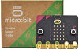|
| 2 |Micro:bit 16路舵机扩展板|1|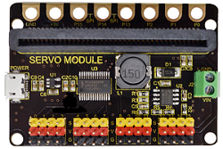|
| 3 |亚克力板|1|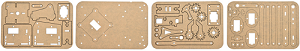|
| 4 |亚克力手柄|1||
| 5 |MeArm ABS圆柱形支架|1||
| 6 |180° 舵机| 3 |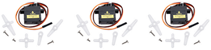|
| 7 |180° 舵机(金属齿轮)|1||
| 8 |摇杆模块|2|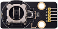|
| 9 |3D PS2摇杆帽|2||
| 10 |十字螺丝刀|1||
| 11 |镀锌扳手|1||
| 12 |M3*6MM 圆头 十字 螺钉|12|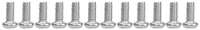|
| 13 |M3*10MM 圆头 十字 螺钉|15|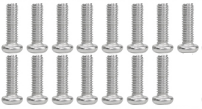|
| 14 |M3*14MM 平头 十字 螺钉|2| 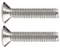 |
| 15 |M3*12MM 圆头 十字 螺钉|10|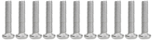|
| 16 |M3*24+6MM 单通铜柱|4|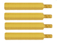|
| 17 |M3*6mm+6mm 单通铜柱|10|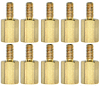|
| 18 |M3 六角螺母|20|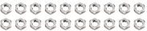|
| 19 |M3 六角自锁螺母|21|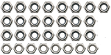|
| 20 |M2x5MM 十字自攻螺钉| 6 |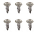|
| 21 | M3 金属垫片 | 12 ||
| 22 | M2x8MM 十字自攻螺钉 | 2 |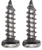|
| 23 |M3*16MM 平头 十字 螺钉|4|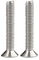|
| 24 |公对母20CM杜邦线| 4 ||
| 25 |鳄鱼夹转杜邦母头|8||
| 26 |黑色 3*100MM 扎带|7||
| 27 |6节 5号电池盒|1|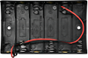|
| 28 |一字螺丝刀|1||
| 29 |USB线|1|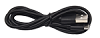|

