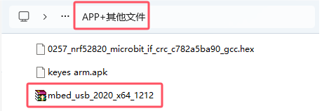

# 机械手臂常见故障排除

**1.机械手臂转动不了**                                                

答：

(1)请检查电池电量是否充足。

(2)看看是不是螺丝扭得太紧？

(3)对应的代码是否上传成功？

(4)如果使用的是Python教程的代码确认是否成功添加了Python库文件“pca9685\.py”和“servo\.py”

**2.电脑识别不了USB端口**

答：

(1)请确保已参考“安装Microbit 驱动”安装了microbit驱动程序。

(2)请检查USB线是否良好。

