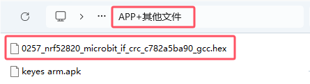
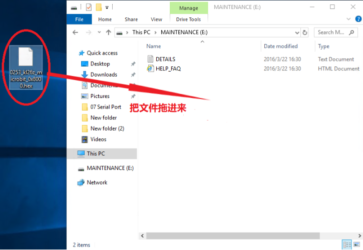
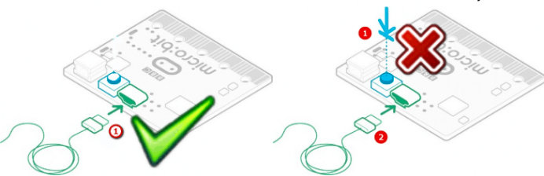
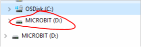
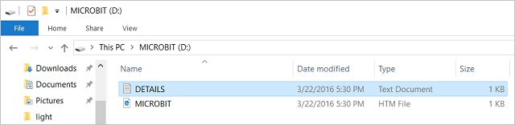
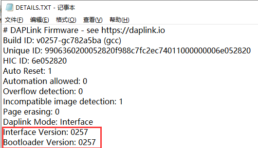
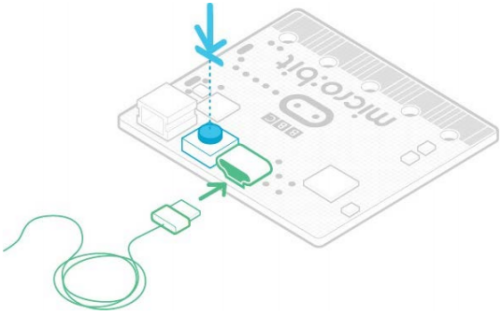

# 相关其他资料

## 1. 关于Micro：bit无法下载程序，盘符显示MAINTENANCE的解决方法

**问题现象：**

很多新用户最近遇到，刚买到的Micro:bit主板插上Micro USB线连接到电脑上，点击下载，下载不进去，Micro:bit主板没有反应。

如果用户的软件操作没有问题的话，可能是自己不小心按着Micro:bit主板上的复位键进入了Micro:bit刷固件模式或者可能是自己的一些误操作导致Micro:bit主板丢失了固件。

所谓的刷固件模式：插上Micro:bit主板，显示多了一个盘符“MAINTENANCE”，进入了刷固件模式后，是无法进行正常的程序下载的。


**解决办法：**

1. 从此页面将十六进制文件下载到您的电脑。 

2. 下载最新的micro:bit固件-0257的链接：[https://www.microbit.org/get-started/user-guide/firmware/](https://www.microbit.org/get-started/user-guide/firmware/) 

（**注意**：你可以点击上述链接下载最新固件十六进制文件；如果你不下载，在相应的文件夹中也有我们事前下载好的最新固件-0257十六进制文件）




按照下图操作，直接将下载好的最新固件十六进制文件拖到“MAINTENANCE”，即可将Micro:bit恢复到正常模式。



**如何避免进入“MAINTENANCE”：**

1. Micro:bit主板插入Micro USB线时，不要按着Micro:bit上的复位键，再插Micro USB线，
很多新手不小心就按着Micro:bit主板上的复位键插上Micro USB线就进入了刷固件模式（新手常犯的错误）



2. 在Micro:bit程序下载过程中，不要突然拔掉，这可能导致固件丢失，Micro:bit主板就会进入刷固件模式了。

3. 在实验过程中，接线接错，导致短路，也有可能导致Micro:bit主板固件丢失，新手操作一定要注意。


## 2. 使用WebUSB对下载进行故障排除

Micro:bit主板与WebUSB（/ device / usb / webusb）配对时遇到问题？让我们尝试找出原因。

**步骤 1: 检查你的线** 

确保使用Micro USB线将Micro:bit主板连接到电脑。 连接后，您应该会在Windows资源管理器中看到一个MICROBIT 驱动器。



如果可以看到MICROBIT驱动器，请转到步骤2。如果看不到该驱动器，请执行以下操作：

● 确保Micro USB线正常工作。

Micro USB线是否在另一台电脑上工作？如果不是，请查找其他Micro USB线。 某些Micro USB线可能仅提供电源连接，实际上并未传输数据。

● 在电脑上尝试另一个USB端口。

电缆是否正常，但是您仍然看不到MICROBIT 驱动器？ 嗯，您的Micro:bit可能有问题。 尝试在Micro:bit.org上的故障查找页面中（https://support.microbit.org/support/solutions/articles/19000024000-fault-finding-with-a-micro-bit ）描述的其他步骤。如果这样做没有帮助，您可以创建支持通知单（https://support.microbit.org/support/tickets/new ）将问题通知Micro:bit基金会。 跳过其余步骤。

**步骤 2: 检查您的固件版本** 

Micro:bit主板上的固件版本可能需要更新。让我们检查： 

1. 找到MICROBIT 驱动 

2. 打开DETAILS.TXT 文件



3. 在文件中查找说明版本号的行。 Version: ... 



如果版本为0234、0241、0243，则需要更新固件（/设备/固件）在您的Micro:bit主板上。 转到步骤3，然后按照升级说明进行操作。 

如果版本是0249、0250或更高版本，则您具有正确的固件，请转到步骤4。

**步骤 3: 升级固件** 

1. 将您的Micro:bit进入维护模式。 为此，请从Micro:bit主板拔下Micro USB线，然后在按住复位按钮的同时重新连接Micro USB线。 插入Micro USB线后，可以释放复位按钮。 现在，您应该像以前一样看到一个MAINTENANCE驱动器，而不是MICROBIT驱动器。 同样，黄色的LED指示灯将在重置按钮旁边保持点亮。
 


2. 下载 firmware .hex file 

[https://microbit.org/guide/firmware/](https://microbit.org/guide/firmware/)

3. 将该文件拖放到 MAINTENANCE驱动器上。

4. 复制HEX文件时，黄色LED指示灯将闪烁。 复制完成后，LED会熄灭，并且micro：bit主板会重置。 现在，MAINTENANCE驱动器会变回MICROBIT。 

5. 升级完成！ 您可以打开DETAILS.TXT 文件进行检查并查看固件版本已更改为与您复制的HEX文件的版本相匹配。
 
 如果您想了解有关连接板，维护模式和升级固件的更多信息，请在固件指南请在固件指南 [https://microbit.org/guide/firmware/](https://microbit.org/guide/firmware/) 中进行阅读。

**步骤 4: 检查您的浏览器版本** 

WebUSB是一项相当新的功能，可能需要您更新浏览器。 检查您的浏览器版本是否符合以下条件之一： 

● 适用于Android，Chrome操作系统，Linux，macOS和Windows 10的Chrome 65+。 

**步骤 5: 配对装置** 

更新固件后，打开Chrome浏览器，转到编辑器，然后点击齿轮菜单中的“配对设备”。 有关配对说明，请参见WebUSB（/ device / usb / webusb）。 

享受快速下载！ 


## 3. 如何更新Micro：bit的固件

**什么是Micro:bit固件?**

固件是使设备正常运行的一种特殊软件。 您可以将其视为使机器按其行为方式运行的软件。

Micro:bit主板的背面有两个芯片。 其中一个运行您的代码，而另一个运行固件以使您能够对设备进行编程。 

Micro:bit主板可以与随附的固件一起使用，因此，如果您不需要对其进行更新，请回到我们的Micro：bit功能指南。

有时您可能需要更新固件以测试新的软件功能。 如果是这种情况，此页面将向您显示操作方法。

**如何找出当前的固件版本** 

升级之前，您需要找出Micro：bit主板上的固件版本。通过Micro USB线将其插入，从MICROBIT驱动器中打开DETAILS.TXT文件，并在以“接口版本”开头的行上查找编号。 

```
## DAPLink Firmware - see https://daplink.io
Build ID: v0257-gc782a5ba (gcc)
Unique ID: 9906360200052820f988c7fc2ec74011000000006e052820
HIC ID: 6e052820
Auto Reset: 1
Automation allowed: 0
Overflow detection: 0
Incompatible image detection: 1
Page erasing: 0
Daplink Mode: Interface
Interface Version: 0257
Bootloader Version: 0257
Git SHA: c782a5ba907377658bc28aa8d132a0fa44543687
Local Mods: 0
USB Interfaces: MSD, CDC, HID, WebUSB
Bootloader CRC: 0x725bea7d
Interface CRC: 0xe561f1de
Remount count: 0
URL: https://microbit.org/device/?id=9906&v=0257
URL: https://microbit.org/device/?id=9904&v=0254
```

**如何更新固件** 

1. 从此页面将十六进制文件下载到您的电脑。

下载最新的Micro:bit 2.2固件-0257的链接：[https://www.microbit.org/get-started/user-guide/firmware/](https://www.microbit.org/get-started/user-guide/firmware/)

（<span style="color: rgb(255, 76, 65);">注意：你可以点击上述链接下载最新固件-0257十六进制文件；如果你不下载，在相应的文件夹中也有我们事前下载好的最新固件-0257十六进制文件</span>）

2. 然后，在卸下电池组并将Micro USB线连接到电脑的情况下，按住Micro:bit主板背面的重置按钮，然后将Micro USB线插入设备。 您应该看到一个名为MAINTENANCE的驱动器出现在文件管理器中。



3. 将您从该页面下载的.HEX拖放到Micro:bit主板上，然后等待设备背面的黄色系统LED停止闪烁。 升级完成后，Micro:bit主板将重置，从计算机中弹出并以正常MICROBIT驱动器模式重新出现。
 
4. 最后，检查MICROBIT驱动器上的DETAILS.TXT文件，并确保它具有与您刚下载并刷新到接口芯片的.HEX固件相同的版本号。
 


