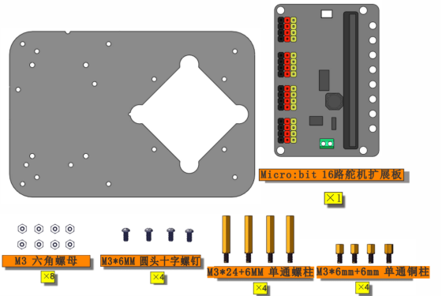
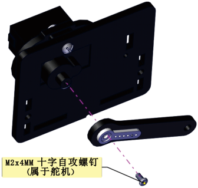
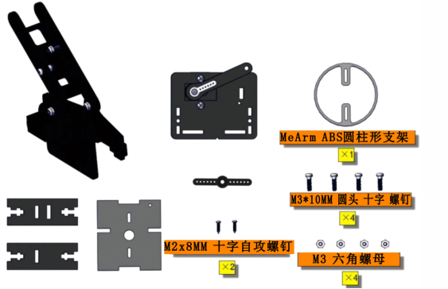
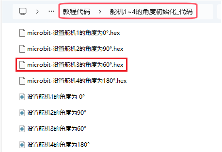
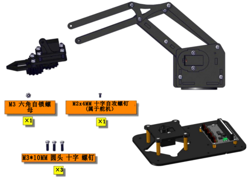

# 组装4自由度机械手臂

**底座部分---安装1**

安装所需零件:



安装:


完成:


**底座舵机部分---安装2**

安装所需零件:


安装:


完成:


**左侧部分(左板+左侧舵机)---安装3**

安装所需零件：


安装：


**舵机4（左侧舵机）初始化：** **<span style="color: rgb(2, 30, 170);"><span style="color: rgb(255, 41, 65);">（注意：舵机安装前必须进行初始化，否则安装后导入代码很容易导致舵机卡死）</span></span>**

安装前需要先设置舵机角度为 180°。设置舵机角度时，将舵机连接在Microbit 16路舵机扩展板的G、V、S（7），在Microbit主控板上上传对应代码，外接电源供电后，按下Microbit主控板上的复位按键，舵机就转到180°的位置。


**方法1：MakeCode 代码**

<span style="color: rgb(255, 76, 65); background: rgb(255, 251, 0);">在编写代码并上传代码至主板之前，必须先安装 MakeCode IDE，安装 MakeCode IDE的说明请点击链接：[MakeCode 开发环境配置](https://www.keyesrobot.cn/projects/KE3060-KE3061/zh-cn/latest/docs/MakeCode_%E6%95%99%E7%A8%8B.html#id1) </span>

舵机4设置为180°的代码：


对应的代码在资料中也有提供，在文件夹 **..\教程代码+Python库文件\教程代码\舵机1~4的角度初始化_代码** ，打开文件 **microbit-设置舵机4的角度为180°\.hex** ，或者在MakeCode IDE中编写上述测试代码。烧录测试代码到Microbit主板中，上传完成后外接电源供电。代码如下图位置:


**方法2：Python 代码**

<span style="color: rgb(255, 76, 65); background: rgb(255, 251, 0);">在编写代码并上传代码至主板之前，必须先安装 Mu 编译器，安装 MU 编译器 的说明请点击链接：[Mu 编译器开发环境设置](https://www.keyesrobot.cn/projects/KE3060-KE3061/zh-cn/latest/docs/Python_%E6%95%99%E7%A8%8B.html#mu) </span>

舵机4设置为180°的代码：


```python
from microbit import sleep, i2c
from PCA9685 import *
from servo import *

## 使用默认地址(0x40)初始化PCA9685.
pwm = PCA9685.PCA9685(i2c)

## 设置舵机频率为60hz
pwm.set_pwm_freq(60)

print('Moving servo on channel 7, press Ctrl-C to quit...')

## 舵机4使用辅助类移动通道7
s4 = Servos(i2c)

## 设置舵机4初始角度(左舵机，通道7)
s4.position(7, 180)
sleep(1000)

```

对应的代码在资料中也有提供，在文件夹 **..\教程代码+Python库文件\教程代码\舵机1~4的角度初始化_代码** ，打开文件 **设置舵机4的角度为180°\.py** ，或者复制并粘贴上述测试代码到 MU 编译器中。烧录测试代码到Microbit主板中，上传完成后外接电源供电。代码如下图位置:


**安装摆臂：**


完成：


**右侧部分(右板+右侧舵机)---安装4**

安装所需零件：


安装：

<span style="color: rgb(255, 76, 65);">(注意亚克力板上的缺口方向)</span>


**舵机1（右侧舵机）初始化：** **<span style="color: rgb(2, 30, 170);"><span style="color: rgb(255, 41, 65);">（注意：舵机安装前必须进行初始化，否则安装后导入代码很容易导致舵机卡死）</span></span>**

安装前需要先设置舵机角度为 0°。设置舵机角度时，将舵机连接在Microbit 16路舵机扩展板的G、V、S（4），在Microbit主控板上上传对应代码，外接电源供电后，按下Microbit主控板上的复位按键，舵机就转到0°的位置。


**方法1：MakeCode 代码**

舵机1设置为0°的代码：


对应的代码在资料中也有提供，在文件夹 **..\教程代码+Python库文件\教程代码\舵机1~4的角度初始化_代码** ，打开文件 **microbit-设置舵机1的角度为0°\.hex** ，或者在MakeCode IDE中编写上述测试代码中。烧录测试代码到Microbit主板中，上传完成后外接电源供电。代码如下图位置:


**方法2：Python 代码**

舵机1设置为0°的代码：


```python
from microbit import sleep, i2c
from PCA9685 import *
from servo import *

## 使用默认地址(0x40)初始化PCA9685.
pwm = PCA9685.PCA9685(i2c)

## 设置舵机频率为60hz
pwm.set_pwm_freq(60)

print('Moving servo on channel 4, press Ctrl-C to quit...')

## 舵机1使用辅助类移动通道4
s1 = Servos(i2c)

## 设置舵机1初始角度(右舵机，通道4)
s1.position(4, 0)
sleep(1000)
```
对应的代码在资料中也有提供，在文件夹 **..\教程代码+Python库文件\教程代码\舵机1~4的角度初始化_代码** ，打开文件 **设置舵机1的角度为0°\.py** ，或者复制并粘贴上述测试代码到 MU 编译器中。烧录测试代码到Microbit主板中，上传完成后外接电源供电。代码如下图位置:


**安装摆臂：**





完成：


**支架部分---安装5**

安装所需零件：


安装：


完成：


**左侧部分+支架部分---安装6**

 安装所需零件：


安装：


完成：


**第6步+第4步(右侧部分)+圆柱支撑台---安装7**

安装所需零件：



安装：

<span style="color: rgb(255, 76, 65);">（注意圆柱支撑台的安装方向）</span>


完成：


**中间部分---安装8**

安装所需零件：


安装：


完成：


**爪子部分(包括舵机)---安装9**

安装所需零件：


安装：


**舵机3（爪子处舵机）初始化：** **<span style="color: rgb(2, 30, 170);"><span style="color: rgb(255, 41, 65);">（注意：舵机安装前必须进行初始化，否则安装后导入代码很容易导致舵机卡死）</span></span>**

安装前需要先设置舵机角度为60°。设置舵机角度时，将舵机连接在Microbit 16路舵机扩展板的G、V、S（6），在Microbit主控板上上传对应代码，外接电源供电后，按下Microbit主控板上的复位按键，舵机就转到60°的位置。


**方法1：MakeCode 代码**

舵机3设置为60°的代码：


对应的代码在资料中也有提供，在文件夹 **..\教程代码+Python库文件\教程代码\舵机1~4的角度初始化_代码** ，打开文件 **microbit-设置舵机3的角度为60°\.hex** ，或者在MakeCode IDE中编写上述测试代码中。烧录测试代码到Microbit主板中，上传完成后外接电源供电。代码如下图位置:




**方法2：Python 代码**

舵机3设置为60°的代码：


```python
from microbit import sleep, i2c
from PCA9685 import *
from servo import *

## 使用默认地址(0x40)初始化PCA9685.
pwm = PCA9685.PCA9685(i2c)

## 设置舵机频率为60hz.
pwm.set_pwm_freq(60)

print('Moving servo on channel 6, press Ctrl-C to quit...')

## 舵机3使用辅助类移动通道6
s3 = Servos(i2c)

## 设置舵机3初始角度(爪子处舵机，通道6)
s3.position(6, 60)
sleep(1000)
```

对应的代码在资料中也有提供，在文件夹 **..\教程代码+Python库文件\教程代码\舵机1~4的角度初始化_代码** ，打开文件 **设置舵机3的角度为60°\.py** ，或者复制并粘贴上述测试代码到 MU 编译器中。烧录测试代码到Microbit主板中，上传完成后外接电源供电。代码如下图位置:


**安装齿轮：**


完成：


**将上面安装好的部分相互组合---安装10**

安装准备零件：



安装：


**舵机2（底座转动舵机）初始化：**  **<span style="color: rgb(2, 30, 170);"><span style="color: rgb(255, 41, 65);">（注意：舵机安装前必须进行初始化，否则安装后导入代码很容易导致舵机卡死）</span></span>**

安装前需要先设置舵机角度为90°。设置舵机角度时，将舵机连接在Microbit 16路舵机扩展板的G、V、S（5），在Microbit主控板上上传对应代码，外接电源供电后，按下Microbit主控板上的复位按键，舵机就转到90°的位置。


**方法1：MakeCode 代码**

舵机2设置为90°的代码：


对应的代码在资料中也有提供，在文件夹 **..\教程代码+Python库文件\教程代码\舵机1~4的角度初始化_代码** ，打开文件 **microbit-设置舵机2的角度为90°\.hex** ，或者在MakeCode IDE中编写上述测试代码中。烧录测试代码到Microbit主板中，上传完成后外接电源供电。代码如下图位置:


**方法2：Python 代码**

舵机2设置为90°的代码：


```
from microbit import sleep, i2c
from PCA9685 import *
from servo import *

## 使用默认地址(0x40)初始化PCA9685..
pwm = PCA9685.PCA9685(i2c)

## 设置舵机频率为60hz
pwm.set_pwm_freq(60)

print('Moving servo on channel 5, press Ctrl-C to quit...')

## 舵机2使用辅助类移动通道5
s2 = Servos(i2c)

##设置舵机2初始角度(底座旋转舵机，通道5)
s2.position(5, 90)
sleep(1000)
```

对应的代码在资料中也有提供，在文件夹 **..\教程代码+Python库文件\教程代码\舵机1~4的角度初始化_代码** ，打开文件 **设置舵机2的角度为90°\.py** ，或者复制并粘贴上述测试代码到 MU 编译器中。烧录测试代码到Microbit主板中，上传完成后外接电源供电。代码如下图位置:


**安装机械臂：**


完成：


**机械手臂控制部分---安装11**

安装准备零件：


安装：


完成：


**接线和安装microbit主板**

舵机1（右侧舵机）：


舵机2（底座转动舵机）：


舵机3（爪子处舵机）：


**<span style="color: rgb(255, 76, 65);">注意：</span>由于这里舵机线不能直接连接到microbit16路舵机扩展板上的引脚，需要使用3根杜邦线将舵机线连接到microbit16路舵机扩展板上的引脚。**

舵机4（左侧舵机）：


插上microbit主板：


左、右摇杆模块：


**完整的Micro:bit 4自由度机械手臂**


**接外接电源**


<span style="color: rgb(255, 76, 65);">用一字螺丝刀（套件提供有）将电池盒的红线端接入VIN端，将黑线端接入GND端。</span>


<span style="color: rgb(255, 76, 65);">电池盒中有弹簧的一端是负极( - )，则另一端是正极( + )。（5号电池自备）</span>